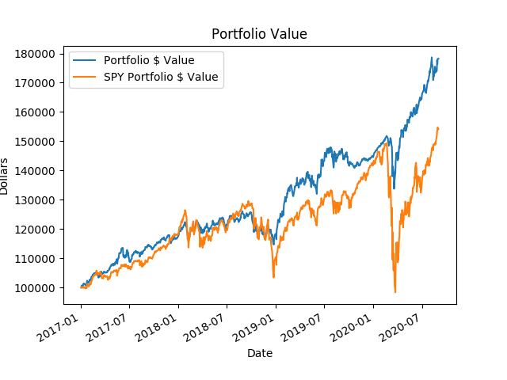
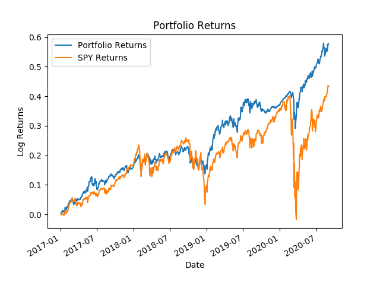
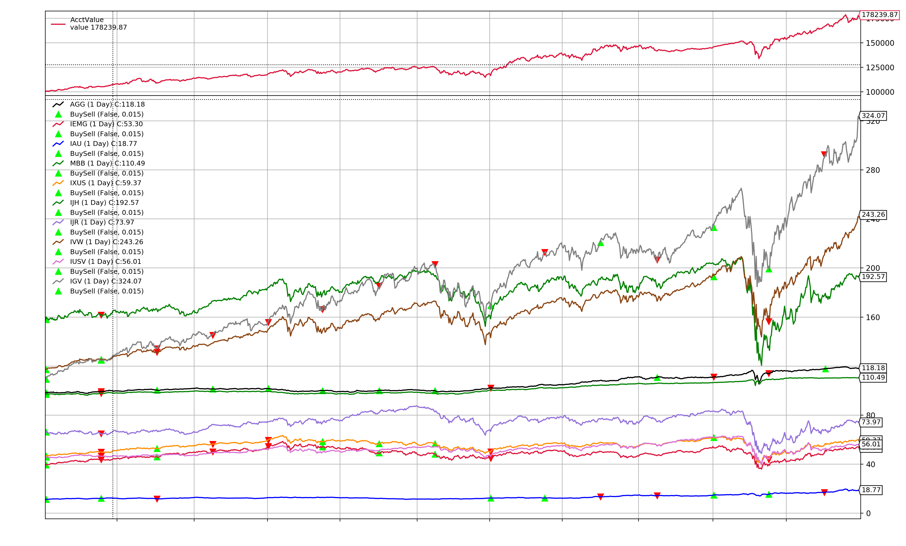

Automated Mean-Variance Rebalancing
---------------------

 * Introduction
 * Setup
 * Running the Application
 * Example
  * Results
  * Statistics

Introduction
------------

This application allows the user to input initial capital, ticker symbols and starting portfolio weights
to then be rebalanced according to Markowitz mean-variance portfolio optimization every quarter.

Setup
------------

To properly run the application, you will need python installed on your machine. You will need 
to create a python 3.5 environment using the req.txt file using the command line.

`pip install -r req.txt
`

Running the Application
-------------
To run the application, open the project in your favorite IDE and activate your python environment
from above. Run the main.py file. 

If you prefer the command line, enter the directory of the project and activate your python environment
created above and run:

`
python main.py
` 

Output png files will be saved and the backtest statistics will be printed in the terminal.


Example
-----------------

With the current settings, our backtest consists of quarterly rebalancing of a 
$100k portfolio over the time period 2017-01-01 to 2020-09-01.

We set the initial weights of each of our selected positions by percentage:

`        ('AGG', 10),
        ('IEMG', 10),
        ('IAU', 10),
        ('MBB', 10),
        ('IXUS', 10),
        ('IJH', 10),
        ('IJR', 10),
        ('IVW', 10),
        ('IUSV', 10),
        ('IGV', 10)
`

We set the months we would like to rebalance to the start of each quarter:

`
('rebalance_months', [1,4,7,10]),)
 `
 
Running the backtest and comparing to SPY we get the following results.

Results
-----------------




Statistics
-----------------

```
Final Portfolio Value: $178239.86999999997
Portfololio PnL: $78239.86999999997
Portfolio Total Log Returns: 0.5779600413968813
Portfolio Sharpe Ratio: 1.6809378121677923
Portfolio Max Drawdown: $18032.72000000003, Time: 121 days

---Compare to SPY---
SPY Portfolio Value: $154166.29655562033
SPY Portfolio Pnl: $54166.29655562033
SPY Total Log Returns: 0.43286168157309385
Trade Analysis Results:
               Total Open     Total Closed   Total Won      Total Lost     
               3              14             8              6              
               Strike Rate    Win Streak     Losing Streak  PnL Net        
               57.14          5              4              2393.92
```


Additional Detail Plot:




```
Position History:
                  AGG      IEMG       IAU       MBB      IXUS       IJH       IJR       IVW      IUSV       IGV       Cash
2017-01-03       0.00      0.00      0.00      0.00      0.00      0.00      0.00      0.00      0.00      0.00  100000.00
2017-01-04    9929.31  10059.75  10044.16   9988.94  10087.20  10077.48  10165.76   9991.75  10041.15  10065.51      85.98
2017-01-05    9970.72  10177.05  10196.48  10018.81  10173.60   9999.36  10018.32  10009.60   9995.16  10086.44      85.98
2017-01-06    9938.40  10128.60  10124.80   9995.12  10143.36   9989.28   9962.08  10071.65  10010.49  10186.54      85.98
2017-01-09    9954.56  10105.65  10196.48  10008.51  10121.76   9923.13   9876.96  10064.00   9933.84  10186.54      85.98
2017-01-10    9951.53  10177.05  10250.24  10011.60  10141.20   9989.91   9965.12  10052.10   9949.17  10196.55      85.98
2017-01-11    9963.65  10276.50  10268.16  10026.02  10218.96  10027.08   9998.56  10075.90   9988.59  10324.86      85.98
2017-01-12    9967.69  10324.95  10312.96  10024.99  10229.76   9972.90   9890.64  10063.15   9946.98  10300.29      85.98
2017-01-13    9949.51  10322.40  10348.80  10003.36  10268.64  10030.23   9963.60  10085.25   9964.50  10349.43      85.98
2017-01-17    9983.85  10319.85  10492.16  10032.20  10249.20   9936.99   9834.40  10065.70   9909.75  10243.87      85.98
2017-01-18    9940.42  10273.95  10393.60   9974.52  10197.36   9981.09   9872.40  10089.50   9929.46  10291.19      85.98
2017-01-19    9915.17  10233.15  10384.64   9969.37  10177.92   9909.90   9779.68  10070.80   9890.04  10285.73      85.98
2017-01-20    9918.20  10266.30  10411.52   9973.49  10229.76   9957.78   9826.80  10097.15   9936.03  10353.98      85.98
2017-01-23    9946.48  10419.30  10483.20  10011.60  10272.96   9934.47   9793.36  10091.20   9887.85  10352.16      85.98
2017-01-24    9930.32  10480.50  10438.40   9983.79  10329.12  10082.52   9936.24  10143.05   9971.07  10499.58      85.98
2017-01-25    9904.06  10577.40  10357.76   9953.92  10422.00  10168.20  10048.72  10221.25  10060.86  10580.57      85.98
2017-01-26    9910.12  10534.05  10250.24   9965.25  10387.44  10134.18   9994.00  10217.85  10054.29  10527.79      85.98
2017-01-27    9918.20  10531.50  10268.16   9980.70  10361.52  10083.15   9952.96  10227.20  10014.87  10577.84      85.98
2017-01-30    9914.16  10488.15  10321.92   9977.61  10307.52  10004.40   9817.68  10164.30   9951.36  10550.54      85.98
2017-01-31    9938.40  10513.65  10456.32   9995.12  10326.96  10033.38   9884.56  10148.15   9964.50  10568.74      85.98
2017-02-01    9924.26  10526.40  10429.44   9982.76  10372.32  10005.03   9873.92  10167.70   9944.79  10505.04      85.98
2017-02-02    9929.31  10572.30  10483.20   9986.88  10383.12  10013.22   9825.28  10177.05   9946.98  10586.94      85.98
2017-02-03    9932.34  10638.60  10519.04   9989.97  10424.16  10150.56   9983.36  10232.30  10036.77  10701.60      85.98
2017-02-06    9960.62  10620.75  10662.40  10019.84  10365.84  10105.83   9890.64  10222.10  10017.06  10668.84      85.98
2017-02-07    9970.72  10569.75  10635.52  10015.72  10350.72  10071.18   9857.20  10235.70   9995.16  10699.78      85.98
2017-02-08    9999.00  10643.70  10698.24  10045.59  10385.28  10080.00   9840.48  10257.80  10003.92  10667.93      85.98
2017-02-09    9975.77  10687.05  10626.56  10017.78  10428.48  10179.54   9998.56  10306.25  10071.81  10802.61      85.98
2017-02-10    9973.75  10766.10  10653.44  10026.02  10465.20  10231.83  10079.12  10344.50  10117.80  10957.31      85.98
2017-02-13    9958.60  10809.45  10581.76  10014.69  10508.40  10261.44  10103.44  10393.80  10163.79  10980.97      85.98
2017-02-14    9936.38  10814.55  10590.72  10004.39  10510.56  10289.79  10126.24  10426.10  10225.11  10987.34      85.98
2017-02-15    9921.23  10906.35  10635.52   9983.79  10553.76  10320.03  10185.52  10483.05  10271.10  11060.14      85.98
2017-02-16    9942.44  10863.00  10689.28  10007.48  10566.72  10311.84  10165.76  10479.65  10260.15  11071.06      85.98
2017-02-17    9964.66  10819.65  10653.44  10021.90  10532.16  10318.77  10150.56  10498.35  10273.29  11129.30      85.98
2017-02-21    9963.65  10934.40  10662.40  10016.75  10581.84  10405.71  10238.72  10550.20  10345.56  11180.26      85.98
2017-02-22    9969.71  10962.45  10671.36  10019.84  10590.48  10372.32  10202.24  10551.05  10332.42  11159.33      85.98
2017-02-23    9986.88  10972.65  10778.88  10039.41  10601.28  10320.66  10130.80  10540.85  10336.80  11162.97      85.98
2017-02-24   10023.24  10857.90  10832.64  10072.37  10497.60  10333.89  10127.76  10573.15  10338.99  11224.85      85.98
2017-02-27   10005.06  10812.00  10787.84  10039.41  10495.44  10405.08  10206.80  10585.90  10349.94  11182.99      85.98
2017-02-28   10002.03  10727.85  10787.84  10042.50  10476.00  10288.53  10044.16  10561.25  10330.23  11075.61      85.98
2017-03-01    9955.57  10885.95  10787.84   9996.15  10573.20  10464.93  10228.08  10692.15  10487.91  11261.25      85.98
2017-03-02    9936.38  10702.35  10653.44   9972.46  10486.80  10350.27  10117.12  10636.05  10417.83  11176.62      85.98
2017-03-03    9944.46  10778.85  10644.48   9978.64  10551.60  10354.05  10088.24  10649.65  10413.45  11177.53      85.98
2017-03-06    9939.41  10781.40  10572.80   9981.73  10517.04  10291.68  10018.32  10628.40  10354.32  11163.88      85.98
2017-03-07    9926.28  10799.25  10492.16   9966.28  10497.60  10231.20   9948.40  10609.70  10312.71  11169.34      85.98
2017-03-08    9903.05  10702.35  10420.48   9949.80  10432.80  10182.69   9883.04  10602.05  10284.24  11213.93      85.98
2017-03-09    9871.74  10615.65  10366.72   9919.93  10450.08  10142.37   9826.80  10609.70  10293.00  11202.10      85.98
2017-03-10    9886.89  10725.30  10384.64   9936.41  10534.32  10192.14   9875.44  10647.95  10321.47  11270.35      85.98
2017-03-13    9870.73  10865.55  10384.64   9910.66  10605.60  10208.52   9905.84  10663.25  10321.47  11350.43      85.98
2017-03-14    9873.76  10809.45  10339.84   9905.51  10527.84  10168.83   9860.24  10631.80  10282.05  11290.37      85.98
2017-03-15    9931.33  11082.30  10519.04   9985.85  10704.96  10306.80  10016.80  10721.05  10367.46  11361.35      85.98
2017-03-16    9920.22  11146.05  10581.76   9962.16  10754.64  10295.46  10035.04  10707.45  10352.13  11421.41      85.98
2017-03-17    9941.43  11143.50  10590.72   9984.82  10778.40  10304.91  10091.28  10704.90  10319.28  11441.43      85.98
2017-03-20    9955.57  11265.90  10635.52   9998.21  10791.36  10262.70  10036.56  10707.45  10282.05  11415.04      85.98
2017-03-21    9976.78  11128.20  10734.08  10020.87  10707.12  10056.69   9770.56  10588.45  10133.13  11202.10      85.98
2017-03-22    9989.91  11189.40  10769.92  10036.32  10726.56  10077.48   9753.84  10624.15  10133.13  11275.81      85.98
2017-03-23    9992.94  11197.05  10743.04  10031.17  10758.96  10105.20   9816.16  10602.05  10139.70  11270.35      85.98
2017-03-24    9984.86  11222.55  10760.96  10028.08  10787.04  10094.49   9816.16  10600.35  10128.75  11293.10      85.98
2017-03-27   10008.09  11194.50  10823.68  10043.53  10793.52  10081.26   9825.28  10596.10  10106.85  11292.19      85.98
2017-03-28    9985.87  11212.35  10787.84  10015.72  10845.36  10157.49   9904.32  10660.70  10194.45  11355.89      85.98
2017-03-29   10008.09  11240.40  10814.72  10042.50  10845.36  10194.03   9930.16  10682.80  10198.83  11410.49      85.98
2017-03-30    9988.90  11179.20  10725.12  10027.05  10819.44  10243.80  10015.28  10695.55  10249.20  11405.03      85.98
2017-03-31    9996.98  11105.25  10760.96  10043.53  10756.80  10247.58  10033.52  10683.65  10211.97  11412.31      85.98
2017-04-03   10033.34  11176.65  10814.72  10071.34  10789.20  10194.03   9849.60  10680.25  10183.50  11358.62      85.98
2017-04-04       0.00      0.00  35399.52      0.00      0.00      0.00      0.00  11188.19      0.00  57445.21    1067.14
2017-04-05       0.00      0.00  35428.80      0.00      0.00      0.00      0.00  11160.60      0.00  57426.77    1067.14
2017-04-06       0.00      0.00  35282.40      0.00      0.00      0.00      0.00  11176.62      0.00  57588.12    1067.14
2017-04-07       0.00      0.00  35370.24      0.00      0.00      0.00      0.00  11171.28      0.00  57597.34    1067.14
2017-04-10       0.00      0.00  35370.24      0.00      0.00      0.00      0.00  11175.73      0.00  57569.68    1067.14
2017-04-11       0.00      0.00  35838.72      0.00      0.00      0.00      0.00  11160.60      0.00  57680.32    1067.14
2017-04-12       0.00      0.00  36131.52      0.00      0.00      0.00      0.00  11117.88      0.00  57394.50    1067.14
2017-04-13       0.00      0.00  36307.20      0.00      0.00      0.00      0.00  11060.92      0.00  57223.93    1067.14
2017-04-17       0.00      0.00  36160.80      0.00      0.00      0.00      0.00  11157.93      0.00  57698.76    1067.14
2017-04-18       0.00      0.00  36336.48      0.00      0.00      0.00      0.00  11135.68      0.00  57924.65    1067.14
2017-04-19       0.00      0.00  36043.68      0.00      0.00      0.00      0.00  11132.12      0.00  58053.73    1067.14
2017-04-20       0.00      0.00  36102.24      0.00      0.00      0.00      0.00  11215.78      0.00  58408.70    1067.14
2017-04-21       0.00      0.00  36219.36      0.00      0.00      0.00      0.00  11202.43      0.00  58464.02    1067.14
2017-04-24       0.00      0.00  35985.12      0.00      0.00      0.00      0.00  11313.68      0.00  59183.18    1067.14
2017-04-25       0.00      0.00  35604.48      0.00      0.00      0.00      0.00  11386.66      0.00  59344.53    1067.14
2017-04-26       0.00      0.00  35780.16      0.00      0.00      0.00      0.00  11379.54      0.00  59220.06    1067.14
2017-04-27       0.00      0.00  35663.04      0.00      0.00      0.00      0.00  11407.13      0.00  59717.94    1067.14
2017-04-28       0.00      0.00  35750.88      0.00      0.00      0.00      0.00  11406.24      0.00  59727.16    1067.14
2017-05-01       0.00      0.00  35399.52      0.00      0.00      0.00      0.00  11451.63      0.00  60160.50    1067.14
2017-05-02       0.00      0.00  35428.80      0.00      0.00      0.00      0.00  11473.88      0.00  60197.38    1067.14
2017-05-03       0.00      0.00  34901.76      0.00      0.00      0.00      0.00  11441.84      0.00  60100.57    1067.14
2017-05-04       0.00      0.00  34579.68      0.00      0.00      0.00      0.00  11457.86      0.00  60450.93    1067.14
2017-05-05       0.00      0.00  34608.96      0.00      0.00      0.00      0.00  11501.47      0.00  60939.59    1067.14
2017-05-08       0.00      0.00  34550.40      0.00      0.00      0.00      0.00  11512.15      0.00  60828.95    1067.14
2017-05-09       0.00      0.00  34345.44      0.00      0.00      0.00      0.00  11521.05      0.00  60838.17    1067.14
2017-05-10       0.00      0.00  34374.72      0.00      0.00      0.00      0.00  11536.18      0.00  61621.87    1067.14
2017-05-11       0.00      0.00  34462.56      0.00      0.00      0.00      0.00  11519.27      0.00  61253.07    1067.14
2017-05-12       0.00      0.00  34579.68      0.00      0.00      0.00      0.00  11521.05      0.00  61299.17    1067.14
2017-05-15       0.00      0.00  34696.80      0.00      0.00      0.00      0.00  11571.78      0.00  61990.67    1067.14
2017-05-16       0.00      0.00  34813.92      0.00      0.00      0.00      0.00  11579.79      0.00  62239.61    1067.14
2017-05-17       0.00      0.00  35487.36      0.00      0.00      0.00      0.00  11368.86      0.00  60354.12    1067.14
2017-05-18       0.00      0.00  35194.56      0.00      0.00      0.00      0.00  11437.39      0.00  60473.98    1067.14
2017-05-19       0.00      0.00  35370.24      0.00      0.00      0.00      0.00  11504.14      0.00  61165.48    1067.14
2017-05-22       0.00      0.00  35487.36      0.00      0.00      0.00      0.00  11578.90      0.00  62036.77    1067.14
2017-05-23       0.00      0.00  35282.40      0.00      0.00      0.00      0.00  11586.02      0.00  62211.95    1067.14
2017-05-24       0.00      0.00  35428.80      0.00      0.00      0.00      0.00  11632.30      0.00  62903.45    1067.14
2017-05-25       0.00      0.00  35399.52      0.00      0.00      0.00      0.00  11713.29      0.00  63576.51    1067.14
2017-05-26       0.00      0.00  35692.32      0.00      0.00      0.00      0.00  11720.41      0.00  63313.74    1067.14
2017-05-30       0.00      0.00  35545.92      0.00      0.00      0.00      0.00  11722.19      0.00  63452.04    1067.14
2017-05-31       0.00      0.00  35721.60      0.00      0.00      0.00      0.00  11728.42      0.00  63327.57    1067.14
2017-06-01       0.00      0.00  35750.88      0.00      0.00      0.00      0.00  11795.17      0.00  63779.35    1067.14
2017-06-02       0.00      0.00  35985.12      0.00      0.00      0.00      0.00  11875.27      0.00  64355.60    1067.14
2017-06-05       0.00      0.00  36043.68      0.00      0.00      0.00      0.00  11870.82      0.00  64401.70    1067.14
2017-06-06       0.00      0.00  36453.60      0.00      0.00      0.00      0.00  11834.33      0.00  64277.23    1067.14
2017-06-07       0.00      0.00  36277.92      0.00      0.00      0.00      0.00  11859.25      0.00  64374.04    1067.14
2017-06-08       0.00      0.00  36014.40      0.00      0.00      0.00      0.00  11847.68      0.00  64355.60    1067.14
2017-06-09       0.00      0.00  35721.60      0.00      0.00      0.00      0.00  11730.20      0.00  62299.54    1067.14
2017-06-12       0.00      0.00  35633.76      0.00      0.00      0.00      0.00  11694.60      0.00  61944.57    1067.14
2017-06-13       0.00      0.00  35692.32      0.00      0.00      0.00      0.00  11767.58      0.00  62516.21    1067.14
2017-06-14       0.00      0.00  35487.36      0.00      0.00      0.00      0.00  11753.34      0.00  62230.39    1067.14
2017-06-15       0.00      0.00  35340.96      0.00      0.00      0.00      0.00  11732.87      0.00  62027.55    1067.14
2017-06-16       0.00      0.00  35340.96      0.00      0.00      0.00      0.00  11739.10      0.00  62096.70    1067.14
2017-06-19       0.00      0.00  35077.44      0.00      0.00      0.00      0.00  11862.81      0.00  63046.36    1067.14
2017-06-20       0.00      0.00  34989.60      0.00      0.00      0.00      0.00  11785.38      0.00  62649.90    1067.14
2017-06-21       0.00      0.00  35077.44      0.00      0.00      0.00      0.00  11822.76      0.00  63544.24    1067.14
2017-06-22       0.00      0.00  35223.84      0.00      0.00      0.00      0.00  11824.54      0.00  64272.62    1067.14
2017-06-23       0.00      0.00  35370.24      0.00      0.00      0.00      0.00  11853.91      0.00  64572.27    1067.14
2017-06-26       0.00      0.00  35018.88      0.00      0.00      0.00      0.00  11831.66      0.00  64254.18    1067.14
2017-06-27       0.00      0.00  35194.56      0.00      0.00      0.00      0.00  11700.83      0.00  63083.24    1067.14
2017-06-28       0.00      0.00  35223.84      0.00      0.00      0.00      0.00  11811.19      0.00  63728.64    1067.14
2017-06-29       0.00      0.00  35018.88      0.00      0.00      0.00      0.00  11659.89      0.00  62530.04    1067.14
2017-06-30       0.00      0.00  34960.32      0.00      0.00      0.00      0.00  11680.36      0.00  62557.70    1067.14
2017-07-03       0.00      0.00  34345.44      0.00      0.00      0.00      0.00  11656.33      0.00  61681.80    1067.14
2017-07-05   52117.98   5893.12      0.00      0.00  17126.64      0.00      0.00      0.00      0.00  32907.06    1296.61
2017-07-06   52014.18   5822.72      0.00      0.00  17019.72      0.00      0.00      0.00      0.00  32656.77    1296.61
2017-07-07   51998.61   5843.20      0.00      0.00  17052.12      0.00      0.00      0.00      0.00  33145.20    1296.61
2017-07-10   52019.37   5888.00      0.00      0.00  17110.44      0.00      0.00      0.00      0.00  33325.02    1296.61
2017-07-11   52071.27   5934.08      0.00      0.00  17162.28      0.00      0.00      0.00      0.00  33397.92    1296.61
2017-07-12   52226.97   6046.72      0.00      0.00  17346.96      0.00      0.00      0.00      0.00  34090.47    1296.61
2017-07-13   52169.88   6071.04      0.00      0.00  17402.04      0.00      0.00      0.00      0.00  33944.67    1296.61
2017-07-14   52221.78   6144.00      0.00      0.00  17551.08      0.00      0.00      0.00      0.00  34114.77    1296.61
2017-07-17   52247.73   6115.84      0.00      0.00  17525.16      0.00      0.00      0.00      0.00  34122.06    1296.61
2017-07-18   52367.10   6136.32      0.00      0.00  17544.60      0.00      0.00      0.00      0.00  34250.85    1296.61
2017-07-19   52377.48   6186.24      0.00      0.00  17635.32      0.00      0.00      0.00      0.00  34559.46    1296.61
2017-07-20   52393.05   6183.68      0.00      0.00  17687.16      0.00      0.00      0.00      0.00  34576.47    1296.61
2017-07-21   52486.47   6174.72      0.00      0.00  17635.32      0.00      0.00      0.00      0.00  34437.96    1296.61
2017-07-24   52434.57   6197.76      0.00      0.00  17632.08      0.00      0.00      0.00      0.00  34617.78    1296.61
2017-07-25   52247.73   6182.40      0.00      0.00  17651.52      0.00      0.00      0.00      0.00  34773.30    1296.61
2017-07-26   52351.53   6231.04      0.00      0.00  17735.76      0.00      0.00      0.00      0.00  34994.43    1296.61
2017-07-27   52273.68   6197.76      0.00      0.00  17693.64      0.00      0.00      0.00      0.00  34413.66    1296.61
2017-07-28   52377.48   6197.76      0.00      0.00  17719.56      0.00      0.00      0.00      0.00  34379.64    1296.61
2017-07-31   52356.72   6202.88      0.00      0.00  17729.28      0.00      0.00      0.00      0.00  34270.29    1296.61
2017-08-01   52496.85   6232.32      0.00      0.00  17832.96      0.00      0.00      0.00      0.00  34386.93    1296.61
2017-08-02   52460.52   6233.60      0.00      0.00  17852.40      0.00      0.00      0.00      0.00  33944.67    1296.61
2017-08-03   52564.32   6202.88      0.00      0.00  17810.28      0.00      0.00      0.00      0.00  34146.36    1296.61
2017-08-04   52481.28   6227.20      0.00      0.00  17852.40      0.00      0.00      0.00      0.00  34126.92    1296.61
2017-08-07   52476.09   6270.72      0.00      0.00  17888.04      0.00      0.00      0.00      0.00  34124.49    1296.61
2017-08-08   52429.38   6266.88      0.00      0.00  17826.48      0.00      0.00      0.00      0.00  33927.66    1296.61
2017-08-09   52476.09   6208.00      0.00      0.00  17755.20      0.00      0.00      0.00      0.00  33859.62    1296.61
2017-08-10   52527.99   6058.24      0.00      0.00  17476.56      0.00      0.00      0.00      0.00  33184.08    1296.61
2017-08-11   52569.51   6076.16      0.00      0.00  17463.60      0.00      0.00      0.00      0.00  33529.14    1296.61
2017-08-14   52548.75   6137.60      0.00      0.00  17612.64      0.00      0.00      0.00      0.00  34071.03    1296.61
2017-08-15   52470.90   6142.72      0.00      0.00  17573.76      0.00      0.00      0.00      0.00  34088.04    1296.61
2017-08-16   52564.32   6202.88      0.00      0.00  17709.84      0.00      0.00      0.00      0.00  34445.25    1296.61
2017-08-17   52642.17   6129.92      0.00      0.00  17512.20      0.00      0.00      0.00      0.00  33837.75    1296.61
2017-08-18   52611.03   6178.56      0.00      0.00  17560.80      0.00      0.00      0.00      0.00  33823.17    1296.61
2017-08-21   52647.36   6199.04      0.00      0.00  17596.44      0.00      0.00      0.00      0.00  34022.43    1296.61
2017-08-22   52600.65   6261.76      0.00      0.00  17703.36      0.00      0.00      0.00      0.00  34610.49    1296.61
2017-08-23   52720.02   6292.48      0.00      0.00  17713.08      0.00      0.00      0.00      0.00  34454.97    1296.61
2017-08-24   52652.55   6309.12      0.00      0.00  17713.08      0.00      0.00      0.00      0.00  34520.58    1296.61
2017-08-25   52688.88   6347.52      0.00      0.00  17816.76      0.00      0.00      0.00      0.00  34603.20    1296.61
2017-08-28   52709.64   6330.88      0.00      0.00  17823.24      0.00      0.00      0.00      0.00  34649.37    1296.61
2017-08-29   52787.49   6316.80      0.00      0.00  17751.96      0.00      0.00      0.00      0.00  34710.12    1296.61
2017-08-30   52777.11   6330.88      0.00      0.00  17735.76      0.00      0.00      0.00      0.00  35203.41    1296.61
2017-08-31   52849.77   6346.24      0.00      0.00  17852.40      0.00      0.00      0.00      0.00  35514.45    1296.61
2017-09-01   52730.40   6389.76      0.00      0.00  17920.44      0.00      0.00      0.00      0.00  35492.58    1296.61
2017-09-05   52943.19   6314.24      0.00      0.00  17777.88      0.00      0.00      0.00      0.00  35371.08    1296.61
2017-09-06   52886.10   6355.20      0.00      0.00  17897.76      0.00      0.00      0.00      0.00  35213.13    1296.61
2017-09-07   53015.85   6400.00      0.00      0.00  18033.84      0.00      0.00      0.00      0.00  35587.35    1296.61
2017-09-08   52953.57   6360.32      0.00      0.00  18007.92      0.00      0.00      0.00      0.00  35519.31    1296.61
2017-09-11   52808.25   6444.80      0.00      0.00  18156.96      0.00      0.00      0.00      0.00  35968.86    1296.61
2017-09-12   52735.59   6438.40      0.00      0.00  18199.08      0.00      0.00      0.00      0.00  35927.55    1296.61
2017-09-13   52678.50   6405.12      0.00      0.00  18105.12      0.00      0.00      0.00      0.00  35793.90    1296.61
2017-09-14   52709.64   6421.76      0.00      0.00  18144.00      0.00      0.00      0.00      0.00  35723.43    1296.61
2017-09-15   52699.26   6460.16      0.00      0.00  18186.12      0.00      0.00      0.00      0.00  35424.54    1296.61
2017-09-18   52673.31   6479.36      0.00      0.00  18218.52      0.00      0.00      0.00      0.00  35487.72    1296.61
2017-09-19   52647.36   6490.88      0.00      0.00  18276.84      0.00      0.00      0.00      0.00  35541.18    1296.61
2017-09-20   52605.84   6465.28      0.00      0.00  18241.20      0.00      0.00      0.00      0.00  35354.07    1296.61
2017-09-21   52595.46   6466.56      0.00      0.00  18208.80      0.00      0.00      0.00      0.00  35111.07    1296.61
2017-09-22   52631.79   6428.16      0.00      0.00  18218.52      0.00      0.00      0.00      0.00  35242.29    1296.61
2017-09-25   52756.35   6311.68      0.00      0.00  18085.68      0.00      0.00      0.00      0.00  34608.06    1296.61
2017-09-26   52735.59   6301.44      0.00      0.00  18046.80      0.00      0.00      0.00      0.00  34593.48    1296.61
2017-09-27   52585.08   6278.40      0.00      0.00  18037.08      0.00      0.00      0.00      0.00  34979.85    1296.61
2017-09-28   52590.27   6272.00      0.00      0.00  18075.96      0.00      0.00      0.00      0.00  34984.71    1296.61
2017-09-29   52543.56   6346.24      0.00      0.00  18202.32      0.00      0.00      0.00      0.00  35266.59    1296.61
2017-10-02   52579.89   6348.80      0.00      0.00  18202.32      0.00      0.00      0.00      0.00  35317.62    1296.61
2017-10-03   54547.82   6292.50      0.00      0.00  18086.40      0.00      0.00      0.00      0.00  34145.28    1053.34
2017-10-04   54531.68   6292.50      0.00      0.00  18067.20      0.00      0.00      0.00      0.00  34229.52    1053.34
2017-10-05   54510.16   6336.25      0.00      0.00  18067.20      0.00      0.00      0.00      0.00  34536.06    1053.34
2017-10-06   54429.46   6306.25      0.00      0.00  18038.40      0.00      0.00      0.00      0.00  34739.64    1053.34
2017-10-09   54504.78   6300.00      0.00      0.00  18032.00      0.00      0.00      0.00      0.00  34554.78    1053.34
2017-10-10   54510.16   6362.50      0.00      0.00  18217.60      0.00      0.00      0.00      0.00  34479.90    1053.34
2017-10-11   54515.54   6388.75      0.00      0.00  18256.00      0.00      0.00      0.00      0.00  34540.74    1053.34
2017-10-12   54580.10   6387.50      0.00      0.00  18259.20      0.00      0.00      0.00      0.00  34765.38    1053.34
2017-10-13   54714.60   6445.00      0.00      0.00  18368.00      0.00      0.00      0.00      0.00  34856.64    1053.34
2017-10-16   54660.80   6438.75      0.00      0.00  18361.60      0.00      0.00      0.00      0.00  34763.04    1053.34
2017-10-17   54644.66   6408.75      0.00      0.00  18294.40      0.00      0.00      0.00      0.00  34749.00    1053.34
2017-10-18   54558.58   6420.00      0.00      0.00  18342.40      0.00      0.00      0.00      0.00  34763.04    1053.34
2017-10-19   54596.24   6371.25      0.00      0.00  18268.80      0.00      0.00      0.00      0.00  35207.64    1053.34
2017-10-20   54440.22   6392.50      0.00      0.00  18256.00      0.00      0.00      0.00      0.00  35579.70    1053.34
2017-10-23   54499.40   6346.25      0.00      0.00  18201.60      0.00      0.00      0.00      0.00  35397.18    1053.34
2017-10-24   54381.04   6351.25      0.00      0.00  18236.80      0.00      0.00      0.00      0.00  35497.80    1053.34
2017-10-25   54348.76   6337.50      0.00      0.00  18169.60      0.00      0.00      0.00      0.00  35411.22    1053.34
2017-10-26   54289.58   6297.50      0.00      0.00  18137.60      0.00      0.00      0.00      0.00  35666.28    1053.34
2017-10-27   54407.94   6385.00      0.00      0.00  18220.80      0.00      0.00      0.00      0.00  36204.48    1053.34
2017-10-30   54558.58   6346.25      0.00      0.00  18246.40      0.00      0.00      0.00      0.00  36153.00    1053.34
2017-10-31   54520.92   6400.00      0.00      0.00  18332.80      0.00      0.00      0.00      0.00  36333.18    1053.34
2017-11-01   54547.82   6435.00      0.00      0.00  18380.80      0.00      0.00      0.00      0.00  36134.28    1053.34
2017-11-02   54574.72   6445.00      0.00      0.00  18409.60      0.00      0.00      0.00      0.00  36260.64    1053.34
2017-11-03   54628.52   6415.00      0.00      0.00  18393.60      0.00      0.00      0.00      0.00  36300.42    1053.34
2017-11-06   54676.94   6480.00      0.00      0.00  18451.20      0.00      0.00      0.00      0.00  36073.44    1053.34
2017-11-07   54693.08   6437.50      0.00      0.00  18387.20      0.00      0.00      0.00      0.00  35991.54    1053.34
2017-11-08   54655.42   6470.00      0.00      0.00  18451.20      0.00      0.00      0.00      0.00  36576.54    1053.34
2017-11-09   54617.76   6435.00      0.00      0.00  18345.60      0.00      0.00      0.00      0.00  36073.44    1053.34
2017-11-10   54397.18   6412.50      0.00      0.00  18291.20      0.00      0.00      0.00      0.00  36190.44    1053.34
2017-11-13   54397.18   6400.00      0.00      0.00  18214.40      0.00      0.00      0.00      0.00  36237.24    1053.34
2017-11-14   54450.98   6365.00      0.00      0.00  18169.60      0.00      0.00      0.00      0.00  36255.96    1053.34
2017-11-15   54558.58   6332.50      0.00      0.00  18083.20      0.00      0.00      0.00      0.00  35982.18    1053.34
2017-11-16   54499.40   6456.25      0.00      0.00  18297.60      0.00      0.00      0.00      0.00  36496.98    1053.34
2017-11-17   54558.58   6480.00      0.00      0.00  18268.80      0.00      0.00      0.00      0.00  36557.82    1053.34
2017-11-20   54526.30   6515.00      0.00      0.00  18310.40      0.00      0.00      0.00      0.00  36630.36    1053.34
2017-11-21   54580.10   6596.25      0.00      0.00  18473.60      0.00      0.00      0.00      0.00  36850.32    1053.34
2017-11-22   54676.94   6612.50      0.00      0.00  18528.00      0.00      0.00      0.00      0.00  36700.56    1053.34
2017-11-24   54666.18   6593.75      0.00      0.00  18620.80      0.00      0.00      0.00      0.00  36960.30    1053.34
2017-11-27   54666.18   6511.25      0.00      0.00  18476.80      0.00      0.00      0.00      0.00  36899.46    1053.34
2017-11-28   54666.18   6555.00      0.00      0.00  18569.60      0.00      0.00      0.00      0.00  37107.72    1053.34
2017-11-29   54531.68   6460.00      0.00      0.00  18454.40      0.00      0.00      0.00      0.00  35783.28    1053.34
2017-11-30   54440.22   6407.50      0.00      0.00  18441.60      0.00      0.00      0.00      0.00  36174.06    1053.34
2017-12-01   54596.24   6370.00      0.00      0.00  18393.60      0.00      0.00      0.00      0.00  36019.62    1053.34
2017-12-04   54590.86   6378.75      0.00      0.00  18320.00      0.00      0.00      0.00      0.00  34800.48    1053.34
2017-12-05   54650.04   6371.25      0.00      0.00  18294.40      0.00      0.00      0.00      0.00  34891.74    1053.34
2017-12-06   54703.84   6290.00      0.00      0.00  18182.40      0.00      0.00      0.00      0.00  35341.02    1053.34
2017-12-07   54633.90   6295.00      0.00      0.00  18233.60      0.00      0.00      0.00      0.00  35633.52    1053.34
2017-12-08   54612.38   6363.75      0.00      0.00  18361.60      0.00      0.00      0.00      0.00  35797.32    1053.34
2017-12-11   54590.86   6400.00      0.00      0.00  18406.40      0.00      0.00      0.00      0.00  36110.88    1053.34
2017-12-12   54569.34   6361.25      0.00      0.00  18368.00      0.00      0.00      0.00      0.00  36007.92    1053.34
2017-12-13   54725.36   6430.00      0.00      0.00  18473.60      0.00      0.00      0.00      0.00  36103.86    1053.34
2017-12-14   54736.12   6385.00      0.00      0.00  18384.00      0.00      0.00      0.00      0.00  36110.88    1053.34
2017-12-15   54752.26   6402.50      0.00      0.00  18380.80      0.00      0.00      0.00      0.00  36567.18    1053.34
2017-12-18   54682.32   6471.25      0.00      0.00  18582.40      0.00      0.00      0.00      0.00  36546.12    1053.34
2017-12-19   54520.92   6441.25      0.00      0.00  18537.60      0.00      0.00      0.00      0.00  36316.80    1053.34
2017-12-20   54397.18   6453.75      0.00      0.00  18531.20      0.00      0.00      0.00      0.00  36167.04    1053.34
2017-12-21   54445.60   6498.75      0.00      0.00  18614.40      0.00      0.00      0.00      0.00  36136.62    1053.34
2017-12-22   54472.50   6551.25      0.00      0.00  18684.80      0.00      0.00      0.00      0.00  35977.50    1053.34
2017-12-26   54515.54   6542.50      0.00      0.00  18684.80      0.00      0.00      0.00      0.00  35874.54    1053.34
2017-12-27   54687.70   6565.00      0.00      0.00  18736.00      0.00      0.00      0.00      0.00  35928.36    1053.34
2017-12-28   54644.66   6610.00      0.00      0.00  18803.20      0.00      0.00      0.00      0.00  36010.26    1053.34
2017-12-29   54698.46   6642.50      0.00      0.00  18828.80      0.00      0.00      0.00      0.00  35890.92    1053.34
2018-01-02   54623.14   6771.25      0.00      0.00  19040.00      0.00      0.00      0.00      0.00  36288.72    1053.34
2018-01-03   56450.68   6503.35      0.00      0.00  18745.57      0.00      0.00      0.00      0.00  35632.19    1057.82
2018-01-04   56417.32   6529.53      0.00      0.00  18895.81      0.00      0.00      0.00      0.00  35909.13    1057.82
2018-01-05   56378.40   6585.46      0.00      0.00  19014.75      0.00      0.00      0.00      0.00  36276.87    1057.82
2018-01-08   56367.28   6590.22      0.00      0.00  19011.62      0.00      0.00      0.00      0.00  36478.90    1057.82
2018-01-09   56211.60   6575.94      0.00      0.00  19014.75      0.00      0.00      0.00      0.00  36474.36    1057.82
2018-01-10   56211.60   6533.10      0.00      0.00  18958.41      0.00      0.00      0.00      0.00  36474.36    1057.82
2018-01-11   56233.84   6579.51      0.00      0.00  19077.35      0.00      0.00      0.00      0.00  36833.02    1057.82
2018-01-12   56228.28   6644.96      0.00      0.00  19255.76      0.00      0.00      0.00      0.00  37223.46    1057.82
2018-01-16   56239.40   6609.26      0.00      0.00  19230.72      0.00      0.00      0.00      0.00  36749.03    1057.82
2018-01-17   56178.24   6694.94      0.00      0.00  19355.92      0.00      0.00      0.00      0.00  37262.05    1057.82
2018-01-18   56055.92   6702.08      0.00      0.00  19346.53      0.00      0.00      0.00      0.00  37359.66    1057.82
2018-01-19   55933.60   6756.82      0.00      0.00  19440.43      0.00      0.00      0.00      0.00  37613.90    1057.82
2018-01-22   55916.92   6794.90      0.00      0.00  19553.11      0.00      0.00      0.00      0.00  37924.89    1057.82
2018-01-23   56050.36   6822.27      0.00      0.00  19615.71      0.00      0.00      0.00      0.00  38083.79    1057.82
2018-01-24   55994.76   6882.96      0.00      0.00  19709.61      0.00      0.00      0.00      0.00  37865.87    1057.82
2018-01-25   56139.32   6874.63      0.00      0.00  19637.62      0.00      0.00      0.00      0.00  37881.76    1057.82
2018-01-26   56033.68   6967.45      0.00      0.00  19828.55      0.00      0.00      0.00      0.00  38526.44    1057.82
2018-01-29   55933.60   6867.49      0.00      0.00  19621.97      0.00      0.00      0.00      0.00  38072.44    1057.82
2018-01-30   55850.20   6778.24      0.00      0.00  19440.43      0.00      0.00      0.00      0.00  37706.97    1057.82
2018-01-31   55894.68   6828.22      0.00      0.00  19443.56      0.00      0.00      0.00      0.00  38328.95    1057.82
2018-02-01   55722.32   6744.92      0.00      0.00  19452.95      0.00      0.00      0.00      0.00  38206.37    1057.82
2018-02-02   55555.52   6577.13      0.00      0.00  19005.36      0.00      0.00      0.00      0.00  37450.46    1057.82
2018-02-05   55777.92   6356.98      0.00      0.00  18276.07      0.00      0.00      0.00      0.00  36290.49    1057.82
2018-02-06   55616.68   6542.62      0.00      0.00  18689.23      0.00      0.00      0.00      0.00  36873.88    1057.82
2018-02-07   55494.36   6346.27      0.00      0.00  18360.58      0.00      0.00      0.00      0.00  36805.78    1057.82
2018-02-08   55399.84   6134.45      0.00      0.00  17866.04      0.00      0.00      0.00      0.00  35132.79    1057.82
2018-02-09   55327.56   6241.55      0.00      0.00  17988.11      0.00      0.00      0.00      0.00  35845.57    1057.82
2018-02-12   55344.24   6330.80      0.00      0.00  18272.94      0.00      0.00      0.00      0.00  36401.72    1057.82
2018-02-13   55355.36   6378.40      0.00      0.00  18269.81      0.00      0.00      0.00      0.00  36626.45    1057.82
2018-02-14   55171.88   6531.91      0.00      0.00  18617.24      0.00      0.00      0.00      0.00  37305.18    1057.82
2018-02-15   55238.60   6654.48      0.00      0.00  18786.26      0.00      0.00      0.00      0.00  38233.61    1057.82
2018-02-16   55344.24   6629.49      0.00      0.00  18833.21      0.00      0.00      0.00      0.00  38160.97    1057.82
2018-02-20   55288.64   6543.81      0.00      0.00  18639.15      0.00      0.00      0.00      0.00  38365.27    1057.82
2018-02-21   55110.72   6535.48      0.00      0.00  18582.81      0.00      0.00      0.00      0.00  38101.95    1057.82
2018-02-22   55116.28   6553.33      0.00      0.00  18651.67      0.00      0.00      0.00      0.00  37983.91    1057.82
2018-02-23   55260.84   6659.24      0.00      0.00  18861.38      0.00      0.00      0.00      0.00  38751.17    1057.82
2018-02-26   55299.76   6716.36      0.00      0.00  19008.49      0.00      0.00      0.00      0.00  39112.10    1057.82
2018-02-27   55183.00   6527.15      0.00      0.00  18667.32      0.00      0.00      0.00      0.00  38778.41    1057.82
2018-02-28   55333.12   6439.09      0.00      0.00  18467.00      0.00      0.00      0.00      0.00  38649.02    1057.82
2018-03-01   55383.16   6437.90      0.00      0.00  18266.68      0.00      0.00      0.00      0.00  38324.41    1057.82
2018-03-02   55294.20   6461.70      0.00      0.00  18332.41      0.00      0.00      0.00      0.00  39091.67    1057.82
2018-03-05   55260.84   6462.89      0.00      0.00  18404.40      0.00      0.00      0.00      0.00  39466.22    1057.82
2018-03-06   55271.96   6524.77      0.00      0.00  18551.51      0.00      0.00      0.00      0.00  39606.96    1057.82
2018-03-07   55260.84   6528.34      0.00      0.00  18526.47      0.00      0.00      0.00      0.00  40256.18    1057.82
2018-03-08   55349.80   6527.15      0.00      0.00  18573.42      0.00      0.00      0.00      0.00  40539.93    1057.82
2018-03-09   55244.16   6662.81      0.00      0.00  18739.31      0.00      0.00      0.00      0.00  41057.49    1057.82
2018-03-12   55277.52   6677.09      0.00      0.00  18773.74      0.00      0.00      0.00      0.00  40991.66    1057.82
2018-03-13   55349.80   6616.40      0.00      0.00  18648.54      0.00      0.00      0.00      0.00  40560.36    1057.82
2018-03-14   55444.32   6634.25      0.00      0.00  18692.36      0.00      0.00      0.00      0.00  40573.98    1057.82
2018-03-15   55449.88   6609.26      0.00      0.00  18657.93      0.00      0.00      0.00      0.00  40530.85    1057.82
2018-03-16   55416.52   6594.98      0.00      0.00  18632.89      0.00      0.00      0.00      0.00  40415.08    1057.82
2018-03-19   55360.92   6524.77      0.00      0.00  18470.13      0.00      0.00      0.00      0.00  39952.00    1057.82
2018-03-20   55271.96   6594.98      0.00      0.00  18523.34      0.00      0.00      0.00      0.00  39961.08    1057.82
2018-03-21   55266.40   6631.87      0.00      0.00  18592.20      0.00      0.00      0.00      0.00  39813.53    1057.82
2018-03-22   55372.04   6416.48      0.00      0.00  18191.56      0.00      0.00      0.00      0.00  38864.67    1057.82
2018-03-23   55372.04   6292.72      0.00      0.00  17969.33      0.00      0.00      0.00      0.00  37924.89    1057.82
2018-03-26   55349.80   6498.59      0.00      0.00  18338.67      0.00      0.00      0.00      0.00  39389.04    1057.82
2018-03-27   55511.04   6385.54      0.00      0.00  18144.61      0.00      0.00      0.00      0.00  37977.10    1057.82
2018-03-28   55538.84   6356.98      0.00      0.00  18172.78      0.00      0.00      0.00      0.00  37529.91    1057.82
2018-03-29   55700.08   6491.45      0.00      0.00  18404.40      0.00      0.00      0.00      0.00  38229.07    1057.82
2018-04-02   55644.48   6368.88      0.00      0.00  18116.44      0.00      0.00      0.00      0.00  37361.93    1057.82
2018-04-03   56782.96   6489.60      0.00      0.00  18856.74      0.00      0.00      0.00      0.00  35715.80    1214.23
2018-04-04   56805.68   6494.40      0.00      0.00  18901.96      0.00      0.00      0.00      0.00  36380.15    1214.23
2018-04-05   56726.16   6510.00      0.00      0.00  19015.01      0.00      0.00      0.00      0.00  36444.65    1214.23
2018-04-06   56851.12   6391.20      0.00      0.00  18817.98      0.00      0.00      0.00      0.00  35647.00    1214.23
2018-04-09   56902.24   6399.60      0.00      0.00  18940.72      0.00      0.00      0.00      0.00  35902.85    1214.23
2018-04-10   56856.80   6518.40      0.00      0.00  19182.97      0.00      0.00      0.00      0.00  36653.20    1214.23
2018-04-11   56907.92   6523.20      0.00      0.00  19134.52      0.00      0.00      0.00      0.00  36511.30    1214.23
2018-04-12   56777.28   6520.80      0.00      0.00  19199.12      0.00      0.00      0.00      0.00  37066.00    1214.23
2018-04-13   56794.32   6462.00      0.00      0.00  19163.59      0.00      0.00      0.00      0.00  36698.35    1214.23
2018-04-16   56805.68   6471.60      0.00      0.00  19202.35      0.00      0.00      0.00      0.00  37115.45    1214.23
2018-04-17   56822.72   6480.00      0.00      0.00  19283.10      0.00      0.00      0.00      0.00  37951.80    1214.23
2018-04-18   56663.68   6530.40      0.00      0.00  19392.92      0.00      0.00      0.00      0.00  38117.35    1214.23
2018-04-19   56521.68   6494.40      0.00      0.00  19308.94      0.00      0.00      0.00      0.00  37786.25    1214.23
2018-04-20   56368.32   6420.00      0.00      0.00  19186.20      0.00      0.00      0.00      0.00  37304.65    1214.23
2018-04-23   56339.92   6369.60      0.00      0.00  19128.06      0.00      0.00      0.00      0.00  37265.95    1214.23
2018-04-24   56266.08   6334.80      0.00      0.00  19037.62      0.00      0.00      0.00      0.00  36629.55    1214.23
2018-04-25   56192.24   6296.40      0.00      0.00  18989.17      0.00      0.00      0.00      0.00  36382.30    1214.23
2018-04-26   56288.80   6373.20      0.00      0.00  19121.60      0.00      0.00      0.00      0.00  37192.85    1214.23
2018-04-27   56356.96   6412.80      0.00      0.00  19163.59      0.00      0.00      0.00      0.00  37106.85    1214.23
2018-04-30   56368.32   6372.00      0.00      0.00  19076.38      0.00      0.00      0.00      0.00  37059.55    1214.23
2018-05-01   56322.88   6342.00      0.00      0.00  19037.62      0.00      0.00      0.00      0.00  37384.20    1214.23
2018-05-02   56322.88   6291.60      0.00      0.00  19002.09      0.00      0.00      0.00      0.00  37179.95    1214.23
2018-05-03   56385.36   6272.40      0.00      0.00  19027.93      0.00      0.00      0.00      0.00  37377.75    1214.23
2018-05-04   56425.12   6303.60      0.00      0.00  19086.07      0.00      0.00      0.00      0.00  37951.80    1214.23
2018-05-07   56396.72   6267.60      0.00      0.00  19079.61      0.00      0.00      0.00      0.00  38353.85    1214.23
2018-05-08   56334.24   6295.20      0.00      0.00  19095.76      0.00      0.00      0.00      0.00  38545.20    1214.23
2018-05-09   56266.08   6306.00      0.00      0.00  19140.98      0.00      0.00      0.00      0.00  39175.15    1214.23
2018-05-10   56396.72   6439.20      0.00      0.00  19321.86      0.00      0.00      0.00      0.00  39527.75    1214.23
2018-05-11   56425.12   6424.80      0.00      0.00  19344.47      0.00      0.00      0.00      0.00  39108.50    1214.23
2018-05-14   56368.32   6430.80      0.00      0.00  19386.46      0.00      0.00      0.00      0.00  38665.60    1214.23
2018-05-15   56118.40   6301.20      0.00      0.00  19199.12      0.00      0.00      0.00      0.00  38495.75    1214.23
2018-05-16   56055.92   6396.00      0.00      0.00  19296.02      0.00      0.00      0.00      0.00  38538.75    1214.23
2018-05-17   55982.08   6309.60      0.00      0.00  19250.80      0.00      0.00      0.00      0.00  38461.35    1214.23
2018-05-18   56124.08   6261.60      0.00      0.00  19157.13      0.00      0.00      0.00      0.00  38717.20    1214.23
2018-05-21   56129.76   6289.20      0.00      0.00  19266.95      0.00      0.00      0.00      0.00  38751.60    1214.23
2018-05-22   56129.76   6310.80      0.00      0.00  19273.41      0.00      0.00      0.00      0.00  38510.80    1214.23
2018-05-23   56283.12   6309.60      0.00      0.00  19124.83      0.00      0.00      0.00      0.00  39011.75    1214.23
2018-05-24   56436.48   6278.40      0.00      0.00  19053.77      0.00      0.00      0.00      0.00  38992.40    1214.23
2018-05-25   56561.44   6300.00      0.00      0.00  18985.94      0.00      0.00      0.00      0.00  38904.25    1214.23
2018-05-29   56936.32   6159.60      0.00      0.00  18601.57      0.00      0.00      0.00      0.00  38646.25    1214.23
2018-05-30   56788.64   6217.20      0.00      0.00  18847.05      0.00      0.00      0.00      0.00  39067.65    1214.23
2018-05-31   56743.20   6223.20      0.00      0.00  18779.22      0.00      0.00      0.00      0.00  39033.25    1214.23
2018-06-01   56675.04   6291.60      0.00      0.00  18937.49      0.00      0.00      0.00      0.00  39671.80    1214.23
2018-06-04   56538.72   6358.80      0.00      0.00  19027.93      0.00      0.00      0.00      0.00  39968.50    1214.23
2018-06-05   56584.16   6312.00      0.00      0.00  18992.40      0.00      0.00      0.00      0.00  40273.80    1214.23
2018-06-06   56453.52   6403.20      0.00      0.00  19163.59      0.00      0.00      0.00      0.00  40536.10    1214.23
2018-06-07   56578.48   6310.80      0.00      0.00  19021.47      0.00      0.00      0.00      0.00  39850.25    1214.23
2018-06-08   56493.28   6306.00      0.00      0.00  19053.77      0.00      0.00      0.00      0.00  40138.35    1214.23
2018-06-11   56436.48   6298.80      0.00      0.00  19131.29      0.00      0.00      0.00      0.00  40248.00    1214.23
2018-06-12   56453.52   6288.00      0.00      0.00  19047.31      0.00      0.00      0.00      0.00  40660.80    1214.23
2018-06-13   56402.40   6242.40      0.00      0.00  19027.93      0.00      0.00      0.00      0.00  40813.45    1214.23
2018-06-14   56544.40   6201.60      0.00      0.00  18963.33      0.00      0.00      0.00      0.00  41034.90    1214.23
2018-06-15   56567.12   6159.60      0.00      0.00  18847.05      0.00      0.00      0.00      0.00  40929.55    1214.23
2018-06-18   56578.48   6075.60      0.00      0.00  18685.55      0.00      0.00      0.00      0.00  41178.95    1214.23
2018-06-19   56635.28   6003.60      0.00      0.00  18501.44      0.00      0.00      0.00      0.00  40877.95    1214.23
2018-06-20   56527.36   6032.40      0.00      0.00  18543.43      0.00      0.00      0.00      0.00  40729.60    1214.23
2018-06-21   56544.40   5949.60      0.00      0.00  18385.16      0.00      0.00      0.00      0.00  40295.30    1214.23
2018-06-22   56595.52   6007.20      0.00      0.00  18572.50      0.00      0.00      0.00      0.00  39605.15    1214.23
2018-06-25   56567.12   5934.00      0.00      0.00  18323.79      0.00      0.00      0.00      0.00  38813.95    1214.23
2018-06-26   56658.00   5906.40      0.00      0.00  18333.48      0.00      0.00      0.00      0.00  39016.05    1214.23
2018-06-27   56760.24   5791.20      0.00      0.00  18107.38      0.00      0.00      0.00      0.00  38136.70    1214.23
2018-06-28   56754.56   5834.40      0.00      0.00  18194.59      0.00      0.00      0.00      0.00  38829.00    1214.23
2018-06-29   56800.00   5934.00      0.00      0.00  18381.93      0.00      0.00      0.00      0.00  38983.80    1214.23
2018-07-02   56748.88   5863.20      0.00      0.00  18165.52      0.00      0.00      0.00      0.00  39656.75    1214.23
2018-07-03   58464.24   6600.15      0.00      0.00  19218.76      0.00      0.00      0.00      0.00  36104.19    1193.28
2018-07-05   58522.64   6585.30      0.00      0.00  19344.93      0.00      0.00      0.00      0.00  36411.51    1193.28
2018-07-06   58581.04   6671.70      0.00      0.00  19488.15      0.00      0.00      0.00      0.00  36911.89    1193.28
2018-07-09   58528.48   6785.10      0.00      0.00  19689.34      0.00      0.00      0.00      0.00  37101.01    1193.28
2018-07-10   58481.76   6767.55      0.00      0.00  19699.57      0.00      0.00      0.00      0.00  37095.10    1193.28
2018-07-11   58505.12   6642.00      0.00      0.00  19351.75      0.00      0.00      0.00      0.00  37345.29    1193.28
2018-07-12   58575.20   6736.50      0.00      0.00  19532.48      0.00      0.00      0.00      0.00  38349.99    1193.28
2018-07-13   58633.60   6733.80      0.00      0.00  19587.04      0.00      0.00      0.00      0.00  38369.69    1193.28
2018-07-16   58563.52   6708.15      0.00      0.00  19559.76      0.00      0.00      0.00      0.00  38141.17    1193.28
2018-07-17   58546.00   6752.70      0.00      0.00  19590.45      0.00      0.00      0.00      0.00  38462.28    1193.28
2018-07-18   58528.48   6745.95      0.00      0.00  19593.86      0.00      0.00      0.00      0.00  38525.32    1193.28
2018-07-19   58616.08   6664.95      0.00      0.00  19494.97      0.00      0.00      0.00      0.00  38306.65    1193.28
2018-07-20   58499.28   6758.10      0.00      0.00  19631.37      0.00      0.00      0.00      0.00  38288.92    1193.28
2018-07-23   58294.88   6708.15      0.00      0.00  19597.27      0.00      0.00      0.00      0.00  38415.00    1193.28
2018-07-24   58376.64   6805.35      0.00      0.00  19737.08      0.00      0.00      0.00      0.00  37955.99    1193.28
2018-07-25   58382.48   6912.00      0.00      0.00  19934.86      0.00      0.00      0.00      0.00  38558.81    1193.28
2018-07-26   58353.28   6844.50      0.00      0.00  19829.15      0.00      0.00      0.00      0.00  38442.58    1193.28
2018-07-27   58394.16   6864.75      0.00      0.00  19859.84      0.00      0.00      0.00      0.00  37459.55    1193.28
2018-07-30   58335.76   6851.25      0.00      0.00  19853.02      0.00      0.00      0.00      0.00  36151.47    1193.28
2018-07-31   58382.48   6876.90      0.00      0.00  19866.66      0.00      0.00      0.00      0.00  36275.58    1193.28
2018-08-01   58324.08   6833.70      0.00      0.00  19788.23      0.00      0.00      0.00      0.00  36486.37    1193.28
2018-08-02   58347.44   6745.95      0.00      0.00  19614.32      0.00      0.00      0.00      0.00  37102.98    1193.28
2018-08-03   58470.08   6794.55      0.00      0.00  19679.11      0.00      0.00      0.00      0.00  37057.67    1193.28
2018-08-06   58510.96   6750.00      0.00      0.00  19573.40      0.00      0.00      0.00      0.00  37317.71    1193.28
2018-08-07   58405.84   6812.10      0.00      0.00  19709.80      0.00      0.00      0.00      0.00  37424.09    1193.28
2018-08-08   58405.84   6798.60      0.00      0.00  19689.34      0.00      0.00      0.00      0.00  37504.86    1193.28
2018-08-09   58487.60   6785.10      0.00      0.00  19648.42      0.00      0.00      0.00      0.00  37674.28    1193.28
2018-08-10   58616.08   6640.65      0.00      0.00  19266.50      0.00      0.00      0.00      0.00  37692.01    1193.28
2018-08-13   58651.12   6531.30      0.00      0.00  19126.69      0.00      0.00      0.00      0.00  37516.68    1193.28
2018-08-14   58592.72   6573.15      0.00      0.00  19171.02      0.00      0.00      0.00      0.00  37788.54    1193.28
2018-08-15   58674.48   6393.60      0.00      0.00  18850.48      0.00      0.00      0.00      0.00  37254.67    1193.28
2018-08-16   58709.52   6435.45      0.00      0.00  18963.01      0.00      0.00      0.00      0.00  37426.06    1193.28
2018-08-17   58744.56   6497.55      0.00      0.00  19096.00      0.00      0.00      0.00      0.00  37292.10    1193.28
2018-08-20   58861.36   6523.20      0.00      0.00  19177.84      0.00      0.00      0.00      0.00  37392.57    1193.28
2018-08-21   58808.80   6600.15      0.00      0.00  19324.47      0.00      0.00      0.00      0.00  37508.80    1193.28
2018-08-22   58861.36   6647.40      0.00      0.00  19416.54      0.00      0.00      0.00      0.00  37896.89    1193.28
2018-08-23   58826.32   6550.20      0.00      0.00  19246.04      0.00      0.00      0.00      0.00  38080.10    1193.28
2018-08-24   58890.56   6659.55      0.00      0.00  19416.54      0.00      0.00      0.00      0.00  39080.86    1193.28
2018-08-27   58814.64   6750.00      0.00      0.00  19679.11      0.00      0.00      0.00      0.00  39067.07    1193.28
2018-08-28   58703.68   6729.75      0.00      0.00  19645.01      0.00      0.00      0.00      0.00  39218.76    1193.28
2018-08-29   58692.00   6762.15      0.00      0.00  19743.90      0.00      0.00      0.00      0.00  39671.86    1193.28
2018-08-30   58721.20   6598.80      0.00      0.00  19477.92      0.00      0.00      0.00      0.00  39309.38    1193.28
2018-08-31   58715.36   6650.10      0.00      0.00  19419.95      0.00      0.00      0.00      0.00  39273.92    1193.28
2018-09-04   58651.12   6515.10      0.00      0.00  19171.02      0.00      0.00      0.00      0.00  39433.49    1193.28
2018-09-05   58621.92   6424.65      0.00      0.00  19010.75      0.00      0.00      0.00      0.00  38381.51    1193.28
2018-09-06   58721.20   6428.70      0.00      0.00  18969.83      0.00      0.00      0.00      0.00  38594.27    1193.28
2018-09-07   58510.96   6396.30      0.00      0.00  18853.89      0.00      0.00      0.00      0.00  38814.91    1193.28
2018-09-10   58569.36   6331.50      0.00      0.00  18870.94      0.00      0.00      0.00      0.00  39147.84    1193.28
2018-09-11   58470.08   6347.70      0.00      0.00  18894.81      0.00      0.00      0.00      0.00  39561.54    1193.28
2018-09-12   58505.12   6376.05      0.00      0.00  18973.24      0.00      0.00      0.00      0.00  39823.55    1193.28
2018-09-13   58546.00   6453.00      0.00      0.00  19136.92      0.00      0.00      0.00      0.00  39979.18    1193.28
2018-09-14   58435.04   6448.95      0.00      0.00  19140.33      0.00      0.00      0.00      0.00  40188.00    1193.28
2018-09-17   58435.04   6400.35      0.00      0.00  19136.92      0.00      0.00      0.00      0.00  39287.71    1193.28
2018-09-18   58306.56   6455.70      0.00      0.00  19321.06      0.00      0.00      0.00      0.00  39470.92    1193.28
2018-09-19   58195.60   6535.35      0.00      0.00  19433.59      0.00      0.00      0.00      0.00  38992.21    1193.28
2018-09-20   58271.52   6604.20      0.00      0.00  19621.14      0.00      0.00      0.00      0.00  39315.29    1193.28
2018-09-21   58318.24   6627.15      0.00      0.00  19645.01      0.00      0.00      0.00      0.00  39244.37    1193.28
2018-09-24   58259.84   6550.20      0.00      0.00  19522.25      0.00      0.00      0.00      0.00  39530.02    1193.28
2018-09-25   58236.48   6585.30      0.00      0.00  19624.55      0.00      0.00      0.00      0.00  39849.16    1193.28
2018-09-26   58370.80   6593.40      0.00      0.00  19634.78      0.00      0.00      0.00      0.00  39762.48    1193.28
2018-09-27   58411.68   6624.45      0.00      0.00  19593.86      0.00      0.00      0.00      0.00  39989.03    1193.28
2018-09-28   58353.28   6582.60      0.00      0.00  19464.28      0.00      0.00      0.00      0.00  40079.65    1193.28
2018-10-01   58335.76   6581.25      0.00      0.00  19508.61      0.00      0.00      0.00      0.00  39975.24    1193.28
2018-10-02   60300.00   6748.00      0.00      0.00  19642.42      0.00      0.00      0.00      0.00  36990.75    1204.22
2018-10-03   60016.59   6694.80      0.00      0.00  19611.28      0.00      0.00      0.00      0.00  37142.45    1204.22
2018-10-04   59841.72   6535.20      0.00      0.00  19306.80      0.00      0.00      0.00      0.00  36322.90    1204.22
2018-10-05   59715.09   6504.40      0.00      0.00  19213.38      0.00      0.00      0.00      0.00  36100.90    1204.22
2018-10-08   59690.97   6515.60      0.00      0.00  19130.34      0.00      0.00      0.00      0.00  35190.70    1204.22
2018-10-09   59775.39   6489.00      0.00      0.00  19078.44      0.00      0.00      0.00      0.00  35081.55    1204.22
2018-10-10   59757.30   6305.60      0.00      0.00  18607.88      0.00      0.00      0.00      0.00  33390.65    1204.22
2018-10-11   59938.20   6234.20      0.00      0.00  18372.60      0.00      0.00      0.00      0.00  33207.50    1204.22
2018-10-12   59950.26   6407.80      0.00      0.00  18535.22      0.00      0.00      0.00      0.00  34389.65    1204.22
2018-10-15   59914.08   6343.40      0.00      0.00  18486.78      0.00      0.00      0.00      0.00  33875.35    1204.22
2018-10-16   59950.26   6500.20      0.00      0.00  18836.24      0.00      0.00      0.00      0.00  35179.60    1204.22
2018-10-17   59829.66   6421.80      0.00      0.00  18690.92      0.00      0.00      0.00      0.00  35125.95    1204.22
2018-10-18   59787.45   6256.60      0.00      0.00  18389.90      0.00      0.00      0.00      0.00  34182.45    1204.22
2018-10-19   59733.18   6323.80      0.00      0.00  18472.94      0.00      0.00      0.00      0.00  33581.20    1204.22
2018-10-22   59727.15   6378.40      0.00      0.00  18434.88      0.00      0.00      0.00      0.00  33954.90    1204.22
2018-10-23   59799.51   6312.60      0.00      0.00  18234.20      0.00      0.00      0.00      0.00  33818.00    1204.22
2018-10-24   59950.26   6115.20      0.00      0.00  17749.80      0.00      0.00      0.00      0.00  32312.10    1204.22
2018-10-25   59902.02   6218.80      0.00      0.00  17926.26      0.00      0.00      0.00      0.00  33448.00    1204.22
2018-10-26   60040.71   6155.80      0.00      0.00  17822.46      0.00      0.00      0.00      0.00  32547.05    1204.22
2018-10-29   59974.38   6045.20      0.00      0.00  17687.52      0.00      0.00      0.00      0.00  32315.80    1204.22
2018-10-30   59889.96   6157.20      0.00      0.00  17926.26      0.00      0.00      0.00      0.00  32848.60    1204.22
2018-10-31   59859.81   6230.00      0.00      0.00  18102.72      0.00      0.00      0.00      0.00  33651.50    1204.22
2018-11-01   60010.56   6445.60      0.00      0.00  18414.12      0.00      0.00      0.00      0.00  34001.15    1204.22
2018-11-02   59835.69   6487.60      0.00      0.00  18469.48      0.00      0.00      0.00      0.00  33642.25    1204.22
2018-11-05   59871.87   6507.20      0.00      0.00  18479.86      0.00      0.00      0.00      0.00  33462.80    1204.22
2018-11-06   59877.90   6493.20      0.00      0.00  18535.22      0.00      0.00      0.00      0.00  33468.35    1204.22
2018-11-07   59932.17   6609.40      0.00      0.00  18798.18      0.00      0.00      0.00      0.00  34768.90    1204.22
2018-11-08   59823.63   6448.40      0.00      0.00  18562.90      0.00      0.00      0.00      0.00  34613.50    1204.22
2018-11-09   59895.99   6332.20      0.00      0.00  18382.98      0.00      0.00      0.00      0.00  33697.75    1204.22
2018-11-12   59998.50   6244.00      0.00      0.00  18075.04      0.00      0.00      0.00      0.00  32722.80    1204.22
2018-11-13   60016.59   6316.80      0.00      0.00  18171.92      0.00      0.00      0.00      0.00  32813.45    1204.22
2018-11-14   60022.62   6353.20      0.00      0.00  18199.60      0.00      0.00      0.00      0.00  32495.25    1204.22
2018-11-15   60101.01   6487.60      0.00      0.00  18348.38      0.00      0.00      0.00      0.00  33346.25    1204.22
2018-11-16   60197.49   6507.20      0.00      0.00  18351.84      0.00      0.00      0.00      0.00  33168.65    1204.22
2018-11-19   60191.46   6424.60      0.00      0.00  18192.68      0.00      0.00      0.00      0.00  31376.00    1204.22
2018-11-20   60167.34   6287.40      0.00      0.00  17857.06      0.00      0.00      0.00      0.00  31105.90    1204.22
2018-11-21   60209.55   6399.40      0.00      0.00  18116.56      0.00      0.00      0.00      0.00  31771.90    1204.22
2018-11-23   60191.46   6326.60      0.00      0.00  17981.62      0.00      0.00      0.00      0.00  31733.05    1204.22
2018-11-26   60179.40   6403.60      0.00      0.00  18223.82      0.00      0.00      0.00      0.00  32476.75    1204.22
2018-11-27   60197.49   6441.40      0.00      0.00  18196.14      0.00      0.00      0.00      0.00  32280.65    1204.22
2018-11-28   60312.06   6595.40      0.00      0.00  18476.40      0.00      0.00      0.00      0.00  33664.45    1204.22
2018-11-29   60342.21   6543.60      0.00      0.00  18389.90      0.00      0.00      0.00      0.00  33701.45    1204.22
2018-11-30   60324.12   6521.20      0.00      0.00  18317.24      0.00      0.00      0.00      0.00  34089.95    1204.22
2018-12-03   60420.60   6665.40      0.00      0.00  18611.34      0.00      0.00      0.00      0.00  34324.90    1204.22
2018-12-04   60583.41   6533.80      0.00      0.00  18154.62      0.00      0.00      0.00      0.00  33327.75    1204.22
2018-12-06   60734.16   6472.20      0.00      0.00  17985.08      0.00      0.00      0.00      0.00  33618.20    1204.22
2018-12-07   60812.55   6347.60      0.00      0.00  17770.56      0.00      0.00      0.00      0.00  32548.90    1204.22
2018-12-10   60854.76   6284.60      0.00      0.00  17601.02      0.00      0.00      0.00      0.00  33050.25    1204.22
2018-12-11   60872.85   6329.40      0.00      0.00  17635.62      0.00      0.00      0.00      0.00  33042.85    1204.22
2018-12-12   60824.61   6430.20      0.00      0.00  17888.20      0.00      0.00      0.00      0.00  33496.10    1204.22
2018-12-13   60842.70   6435.80      0.00      0.00  17877.82      0.00      0.00      0.00      0.00  33425.80    1204.22
2018-12-14   60860.79   6347.60      0.00      0.00  17635.62      0.00      0.00      0.00      0.00  32571.10    1204.22
2018-12-17   60963.30   6288.80      0.00      0.00  17476.46      0.00      0.00      0.00      0.00  31540.65    1204.22
2018-12-18   61144.20   6333.60      0.00      0.00  17528.36      0.00      0.00      0.00      0.00  31868.10    1204.22
2018-12-19   61198.47   6230.00      0.00      0.00  17344.98      0.00      0.00      0.00      0.00  31670.15    1204.22
2018-12-20   61144.20   6288.80      0.00      0.00  17317.30      0.00      0.00      0.00      0.00  31115.15    1204.22
2018-12-21   61114.05   6228.60      0.00      0.00  17040.50      0.00      0.00      0.00      0.00  29986.65    1204.22
2018-12-24   61156.26   6178.20      0.00      0.00  16867.50      0.00      0.00      0.00      0.00  29268.85    1204.22
2018-12-26   61041.69   6302.80      0.00      0.00  17258.48      0.00      0.00      0.00      0.00  31174.35    1204.22
2018-12-27   61138.17   6295.80      0.00      0.00  17234.26      0.00      0.00      0.00      0.00  31644.25    1204.22
2018-12-28   61361.28   6343.40      0.00      0.00  17389.96      0.00      0.00      0.00      0.00  31592.45    1204.22
2018-12-31   61518.06   6329.40      0.00      0.00  17424.56      0.00      0.00      0.00      0.00  31905.10    1204.22
2019-01-02   61566.30   6344.80      0.00      0.00  17376.12      0.00      0.00      0.00      0.00  31736.75    1204.22
2019-01-03       0.00      0.00  42429.79      0.00      0.00      0.00      0.00      0.00      0.00  72611.92    1460.73
2019-01-04       0.00      0.00  42122.08      0.00      0.00      0.00      0.00      0.00      0.00  75941.86    1460.73
2019-01-07       0.00      0.00  42224.65      0.00      0.00      0.00      0.00      0.00      0.00  77453.88    1460.73
2019-01-08       0.00      0.00  42122.08      0.00      0.00      0.00      0.00      0.00      0.00  78681.85    1460.73
2019-01-09       0.00      0.00  42361.41      0.00      0.00      0.00      0.00      0.00      0.00  79206.25    1460.73
2019-01-10       0.00      0.00  42122.08      0.00      0.00      0.00      0.00      0.00      0.00  79630.14    1460.73
2019-01-11       0.00      0.00  42190.46      0.00      0.00      0.00      0.00      0.00      0.00  79367.94    1460.73
2019-01-14       0.00      0.00  42293.03      0.00      0.00      0.00      0.00      0.00      0.00  78520.16    1460.73
2019-01-15       0.00      0.00  42224.65      0.00      0.00      0.00      0.00      0.00      0.00  79953.52    1460.73
2019-01-16       0.00      0.00  42361.41      0.00      0.00      0.00      0.00      0.00      0.00  79896.71    1460.73
2019-01-17       0.00      0.00  42327.22      0.00      0.00      0.00      0.00      0.00      0.00  80486.66    1460.73
2019-01-18       0.00      0.00  41951.13      0.00      0.00      0.00      0.00      0.00      0.00  81893.80    1460.73
2019-01-22       0.00      0.00  42053.70      0.00      0.00      0.00      0.00      0.00      0.00  80753.23    1460.73
2019-01-23       0.00      0.00  42019.51      0.00      0.00      0.00      0.00      0.00      0.00  80731.38    1460.73
2019-01-24       0.00      0.00  41916.94      0.00      0.00      0.00      0.00      0.00      0.00  80888.70    1460.73
2019-01-25       0.00      0.00  42566.55      0.00      0.00      0.00      0.00      0.00      0.00  82116.67    1460.73
2019-01-28       0.00      0.00  42669.12      0.00      0.00      0.00      0.00      0.00      0.00  81286.37    1460.73
2019-01-29       0.00      0.00  42976.83      0.00      0.00      0.00      0.00      0.00      0.00  80268.16    1460.73
2019-01-30       0.00      0.00  43181.97      0.00      0.00      0.00      0.00      0.00      0.00  82081.71    1460.73
2019-01-31       0.00      0.00  43216.16      0.00      0.00      0.00      0.00      0.00      0.00  83480.11    1460.73
2019-02-01       0.00      0.00  43147.78      0.00      0.00      0.00      0.00      0.00      0.00  84236.12    1460.73
2019-02-04       0.00      0.00  42942.64      0.00      0.00      0.00      0.00      0.00      0.00  85678.22    1460.73
2019-02-05       0.00      0.00  43045.21      0.00      0.00      0.00      0.00      0.00      0.00  86477.93    1460.73
2019-02-06       0.00      0.00  42771.69      0.00      0.00      0.00      0.00      0.00      0.00  85564.60    1460.73
2019-02-07       0.00      0.00  42908.45      0.00      0.00      0.00      0.00      0.00      0.00  85022.72    1460.73
2019-02-08       0.00      0.00  43045.21      0.00      0.00      0.00      0.00      0.00      0.00  86447.34    1460.73
2019-02-11       0.00      0.00  42840.07      0.00      0.00      0.00      0.00      0.00      0.00  86416.75    1460.73
2019-02-12       0.00      0.00  42942.64      0.00      0.00      0.00      0.00      0.00      0.00  87828.26    1460.73
2019-02-13       0.00      0.00  42771.69      0.00      0.00      0.00      0.00      0.00      0.00  87815.15    1460.73
2019-02-14       0.00      0.00  43011.02      0.00      0.00      0.00      0.00      0.00      0.00  88230.30    1460.73
2019-02-15       0.00      0.00  43284.54      0.00      0.00      0.00      0.00      0.00      0.00  88671.67    1460.73
2019-02-19       0.00      0.00  43899.96      0.00      0.00      0.00      0.00      0.00      0.00  88789.66    1460.73
2019-02-20       0.00      0.00  43865.77      0.00      0.00      0.00      0.00      0.00      0.00  88042.39    1460.73
2019-02-21       0.00      0.00  43318.73      0.00      0.00      0.00      0.00      0.00      0.00  88160.38    1460.73
2019-02-22       0.00      0.00  43523.87      0.00      0.00      0.00      0.00      0.00      0.00  89536.93    1460.73
2019-02-25       0.00      0.00  43489.68      0.00      0.00      0.00      0.00      0.00      0.00  89781.65    1460.73
2019-02-26       0.00      0.00  43523.87      0.00      0.00      0.00      0.00      0.00      0.00  89995.78    1460.73
2019-02-27       0.00      0.00  43250.35      0.00      0.00      0.00      0.00      0.00      0.00  90384.71    1460.73
2019-02-28       0.00      0.00  43011.02      0.00      0.00      0.00      0.00      0.00      0.00  89952.08    1460.73
2019-03-01       0.00      0.00  42258.84      0.00      0.00      0.00      0.00      0.00      0.00  90384.71    1460.73
2019-03-04       0.00      0.00  42156.27      0.00      0.00      0.00      0.00      0.00      0.00  88697.89    1460.73
2019-03-05       0.00      0.00  42190.46      0.00      0.00      0.00      0.00      0.00      0.00  88335.18    1460.73
2019-03-06       0.00      0.00  42122.08      0.00      0.00      0.00      0.00      0.00      0.00  87815.15    1460.73
2019-03-07       0.00      0.00  42087.89      0.00      0.00      0.00      0.00      0.00      0.00  87670.94    1460.73
2019-03-08       0.00      0.00  42566.55      0.00      0.00      0.00      0.00      0.00      0.00  87614.13    1460.73
2019-03-11       0.00      0.00  42361.41      0.00      0.00      0.00      0.00      0.00      0.00  89270.36    1460.73
2019-03-12       0.00      0.00  42634.93      0.00      0.00      0.00      0.00      0.00      0.00  89589.37    1460.73
2019-03-13       0.00      0.00  42942.64      0.00      0.00      0.00      0.00      0.00      0.00  90131.25    1460.73
2019-03-14       0.00      0.00  42429.79      0.00      0.00      0.00      0.00      0.00      0.00  90480.85    1460.73
2019-03-15       0.00      0.00  42600.74      0.00      0.00      0.00      0.00      0.00      0.00  90524.55    1460.73
2019-03-18       0.00      0.00  42669.12      0.00      0.00      0.00      0.00      0.00      0.00  90887.26    1460.73
2019-03-19       0.00      0.00  42771.69      0.00      0.00      0.00      0.00      0.00      0.00  91411.66    1460.73
2019-03-20       0.00      0.00  43045.21      0.00      0.00      0.00      0.00      0.00      0.00  91053.32    1460.73
2019-03-21       0.00      0.00  42874.26      0.00      0.00      0.00      0.00      0.00      0.00  93225.21    1460.73
2019-03-22       0.00      0.00  42976.83      0.00      0.00      0.00      0.00      0.00      0.00  90476.48    1460.73
2019-03-25       0.00      0.00  43318.73      0.00      0.00      0.00      0.00      0.00      0.00  90528.92    1460.73
2019-03-26       0.00      0.00  43113.59      0.00      0.00      0.00      0.00      0.00      0.00  91057.69    1460.73
2019-03-27       0.00      0.00  42874.26      0.00      0.00      0.00      0.00      0.00      0.00  89794.76    1460.73
2019-03-28       0.00      0.00  42258.84      0.00      0.00      0.00      0.00      0.00      0.00  90467.74    1460.73
2019-03-29       0.00      0.00  42327.22      0.00      0.00      0.00      0.00      0.00      0.00  91560.24    1460.73
2019-04-01       0.00      0.00  42122.08      0.00      0.00      0.00      0.00      0.00      0.00  92805.69    1460.73
2019-04-02       0.00      0.00  48713.06      0.00      0.00      0.00      0.00      0.00      0.00  86704.08    1225.44
2019-04-03       0.00      0.00  48634.30      0.00      0.00      0.00      0.00      0.00      0.00  87087.60    1225.44
2019-04-04       0.00      0.00  48752.44      0.00      0.00      0.00      0.00      0.00      0.00  85410.72    1225.44
2019-04-05       0.00      0.00  48713.06      0.00      0.00      0.00      0.00      0.00      0.00  85826.88    1225.44
2019-04-08       0.00      0.00  48949.34      0.00      0.00      0.00      0.00      0.00      0.00  85920.72    1225.44
2019-04-09       0.00      0.00  49146.24      0.00      0.00      0.00      0.00      0.00      0.00  85871.76    1225.44
2019-04-10       0.00      0.00  49303.76      0.00      0.00      0.00      0.00      0.00      0.00  86867.28    1225.44
2019-04-11       0.00      0.00  48713.06      0.00      0.00      0.00      0.00      0.00      0.00  87063.12    1225.44
2019-04-12       0.00      0.00  48634.30      0.00      0.00      0.00      0.00      0.00      0.00  87324.24    1225.44
2019-04-15       0.00      0.00  48555.54      0.00      0.00      0.00      0.00      0.00      0.00  87177.36    1225.44
2019-04-16       0.00      0.00  48161.74      0.00      0.00      0.00      0.00      0.00      0.00  86675.52    1225.44
2019-04-17       0.00      0.00  48082.98      0.00      0.00      0.00      0.00      0.00      0.00  85794.24    1225.44
2019-04-18       0.00      0.00  48122.36      0.00      0.00      0.00      0.00      0.00      0.00  85908.48    1225.44
2019-04-22       0.00      0.00  48082.98      0.00      0.00      0.00      0.00      0.00      0.00  86769.36    1225.44
2019-04-23       0.00      0.00  47964.84      0.00      0.00      0.00      0.00      0.00      0.00  88128.00    1225.44
2019-04-24       0.00      0.00  48122.36      0.00      0.00      0.00      0.00      0.00      0.00  87993.36    1225.44
2019-04-25       0.00      0.00  48161.74      0.00      0.00      0.00      0.00      0.00      0.00  88764.48    1225.44
2019-04-26       0.00      0.00  48437.40      0.00      0.00      0.00      0.00      0.00      0.00  89482.56    1225.44
2019-04-29       0.00      0.00  48240.50      0.00      0.00      0.00      0.00      0.00      0.00  89682.48    1225.44
2019-04-30       0.00      0.00  48398.02      0.00      0.00      0.00      0.00      0.00      0.00  89968.08    1225.44
2019-05-01       0.00      0.00  48082.98      0.00      0.00      0.00      0.00      0.00      0.00  88556.40    1225.44
2019-05-02       0.00      0.00  47925.46      0.00      0.00      0.00      0.00      0.00      0.00  88250.40    1225.44
2019-05-03       0.00      0.00  48161.74      0.00      0.00      0.00      0.00      0.00      0.00  89135.76    1225.44
2019-05-06       0.00      0.00  48240.50      0.00      0.00      0.00      0.00      0.00      0.00  89046.00    1225.44
2019-05-07       0.00      0.00  48398.02      0.00      0.00      0.00      0.00      0.00      0.00  87026.40    1225.44
2019-05-08       0.00      0.00  48279.88      0.00      0.00      0.00      0.00      0.00      0.00  87001.92    1225.44
2019-05-09       0.00      0.00  48437.40      0.00      0.00      0.00      0.00      0.00      0.00  86899.92    1225.44
2019-05-10       0.00      0.00  48516.16      0.00      0.00      0.00      0.00      0.00      0.00  87418.08    1225.44
2019-05-13       0.00      0.00  48988.72      0.00      0.00      0.00      0.00      0.00      0.00  84092.88    1225.44
2019-05-14       0.00      0.00  48909.96      0.00      0.00      0.00      0.00      0.00      0.00  85945.20    1225.44
2019-05-15       0.00      0.00  48831.20      0.00      0.00      0.00      0.00      0.00      0.00  86793.84    1225.44
2019-05-16       0.00      0.00  48516.16      0.00      0.00      0.00      0.00      0.00      0.00  88519.68    1225.44
2019-05-17       0.00      0.00  48122.36      0.00      0.00      0.00      0.00      0.00      0.00  87520.08    1225.44
2019-05-20       0.00      0.00  48122.36      0.00      0.00      0.00      0.00      0.00      0.00  85977.84    1225.44
2019-05-21       0.00      0.00  48004.22      0.00      0.00      0.00      0.00      0.00      0.00  86965.20    1225.44
2019-05-22       0.00      0.00  48004.22      0.00      0.00      0.00      0.00      0.00      0.00  87250.80    1225.44
2019-05-23       0.00      0.00  48358.64      0.00      0.00      0.00      0.00      0.00      0.00  85235.28    1225.44
2019-05-24       0.00      0.00  48398.02      0.00      0.00      0.00      0.00      0.00      0.00  85643.28    1225.44
2019-05-28       0.00      0.00  48201.12      0.00      0.00      0.00      0.00      0.00      0.00  85814.64    1225.44
2019-05-29       0.00      0.00  48240.50      0.00      0.00      0.00      0.00      0.00      0.00  84721.20    1225.44
2019-05-30       0.00      0.00  48555.54      0.00      0.00      0.00      0.00      0.00      0.00  85027.20    1225.44
2019-05-31       0.00      0.00  49264.38      0.00      0.00      0.00      0.00      0.00      0.00  83631.84    1225.44
2019-06-03       0.00      0.00  49933.84      0.00      0.00      0.00      0.00      0.00      0.00  80853.36    1225.44
2019-06-04       0.00      0.00  50012.60      0.00      0.00      0.00      0.00      0.00      0.00  83611.44    1225.44
2019-06-05       0.00      0.00  50130.74      0.00      0.00      0.00      0.00      0.00      0.00  84876.24    1225.44
2019-06-06       0.00      0.00  50248.88      0.00      0.00      0.00      0.00      0.00      0.00  85422.96    1225.44
2019-06-07       0.00      0.00  50524.54      0.00      0.00      0.00      0.00      0.00      0.00  86695.92    1225.44
2019-06-10       0.00      0.00  50091.36      0.00      0.00      0.00      0.00      0.00      0.00  87332.40    1225.44
2019-06-11       0.00      0.00  49973.22      0.00      0.00      0.00      0.00      0.00      0.00  86320.56    1225.44
2019-06-12       0.00      0.00  50248.88      0.00      0.00      0.00      0.00      0.00      0.00  86536.80    1225.44
2019-06-13       0.00      0.00  50524.54      0.00      0.00      0.00      0.00      0.00      0.00  86879.52    1225.44
2019-06-14       0.00      0.00  50524.54      0.00      0.00      0.00      0.00      0.00      0.00  86100.24    1225.44
2019-06-17       0.00      0.00  50485.16      0.00      0.00      0.00      0.00      0.00      0.00  86283.84    1225.44
2019-06-18       0.00      0.00  50721.44      0.00      0.00      0.00      0.00      0.00      0.00  87181.44    1225.44
2019-06-19       0.00      0.00  51075.86      0.00      0.00      0.00      0.00      0.00      0.00  88503.36    1225.44
2019-06-20       0.00      0.00  52336.02      0.00      0.00      0.00      0.00      0.00      0.00  90139.44    1225.44
2019-06-21       0.00      0.00  52729.82      0.00      0.00      0.00      0.00      0.00      0.00  89478.48    1225.44
2019-06-24       0.00      0.00  53517.42      0.00      0.00      0.00      0.00      0.00      0.00  89062.32    1225.44
2019-06-25       0.00      0.00  53635.56      0.00      0.00      0.00      0.00      0.00      0.00  87059.04    1225.44
2019-06-26       0.00      0.00  53084.24      0.00      0.00      0.00      0.00      0.00      0.00  87144.72    1225.44
2019-06-27       0.00      0.00  53084.24      0.00      0.00      0.00      0.00      0.00      0.00  88168.80    1225.44
2019-06-28       0.00      0.00  53163.00      0.00      0.00      0.00      0.00      0.00      0.00  88601.28    1225.44
2019-07-01       0.00      0.00  52178.50      0.00      0.00      0.00      0.00      0.00      0.00  89964.00    1225.44
2019-07-02       0.00      0.00  52090.50      0.00      0.00      0.00      0.00      0.00      0.00  91377.48    1515.08
2019-07-03       0.00      0.00  52206.00      0.00      0.00      0.00      0.00      0.00      0.00  92391.00    1515.08
2019-07-05       0.00      0.00  51590.00      0.00      0.00      0.00      0.00      0.00      0.00  92230.32    1515.08
2019-07-08       0.00      0.00  51282.00      0.00      0.00      0.00      0.00      0.00      0.00  91789.48    1515.08
2019-07-09       0.00      0.00  51436.00      0.00      0.00      0.00      0.00      0.00      0.00  92263.28    1515.08
2019-07-10       0.00      0.00  52244.50      0.00      0.00      0.00      0.00      0.00      0.00  93087.28    1515.08
2019-07-11       0.00      0.00  51821.00      0.00      0.00      0.00      0.00      0.00      0.00  93618.76    1515.08
2019-07-12       0.00      0.00  52129.00      0.00      0.00      0.00      0.00      0.00      0.00  93812.40    1515.08
2019-07-15       0.00      0.00  52129.00      0.00      0.00      0.00      0.00      0.00      0.00  93758.84    1515.08
2019-07-16       0.00      0.00  51705.50      0.00      0.00      0.00      0.00      0.00      0.00  92675.28    1515.08
2019-07-17       0.00      0.00  52514.00      0.00      0.00      0.00      0.00      0.00      0.00  92877.16    1515.08
2019-07-18       0.00      0.00  53245.50      0.00      0.00      0.00      0.00      0.00      0.00  92873.04    1515.08
2019-07-19       0.00      0.00  52552.50      0.00      0.00      0.00      0.00      0.00      0.00  91962.52    1515.08
2019-07-22       0.00      0.00  52475.50      0.00      0.00      0.00      0.00      0.00      0.00  92592.88    1515.08
2019-07-23       0.00      0.00  52206.00      0.00      0.00      0.00      0.00      0.00      0.00  92489.88    1515.08
2019-07-24       0.00      0.00  52437.00      0.00      0.00      0.00      0.00      0.00      0.00  93940.12    1515.08
2019-07-25       0.00      0.00  52090.50      0.00      0.00      0.00      0.00      0.00      0.00  93355.08    1515.08
2019-07-26       0.00      0.00  52167.50      0.00      0.00      0.00      0.00      0.00      0.00  94212.04    1515.08
2019-07-29       0.00      0.00  52514.00      0.00      0.00      0.00      0.00      0.00      0.00  93046.08    1515.08
2019-07-30       0.00      0.00  52706.50      0.00      0.00      0.00      0.00      0.00      0.00  92386.88    1515.08
2019-07-31       0.00      0.00  52052.00      0.00      0.00      0.00      0.00      0.00      0.00  90903.68    1515.08
2019-08-01       0.00      0.00  53245.50      0.00      0.00      0.00      0.00      0.00      0.00  90821.28    1515.08
2019-08-02       0.00      0.00  53091.50      0.00      0.00      0.00      0.00      0.00      0.00  89029.08    1515.08
2019-08-05       0.00      0.00  53823.00      0.00      0.00      0.00      0.00      0.00      0.00  85658.92    1515.08
2019-08-06       0.00      0.00  54285.00      0.00      0.00      0.00      0.00      0.00      0.00  86552.96    1515.08
2019-08-07       0.00      0.00  55055.00      0.00      0.00      0.00      0.00      0.00      0.00  86779.56    1515.08
2019-08-08       0.00      0.00  55401.50      0.00      0.00      0.00      0.00      0.00      0.00  89585.28    1515.08
2019-08-09       0.00      0.00  55170.50      0.00      0.00      0.00      0.00      0.00      0.00  88757.16    1515.08
2019-08-12       0.00      0.00  55671.00      0.00      0.00      0.00      0.00      0.00      0.00  87298.68    1515.08
2019-08-13       0.00      0.00  55363.00      0.00      0.00      0.00      0.00      0.00      0.00  88790.12    1515.08
2019-08-14       0.00      0.00  55748.00      0.00      0.00      0.00      0.00      0.00      0.00  85753.68    1515.08
2019-08-15       0.00      0.00  56133.00      0.00      0.00      0.00      0.00      0.00      0.00  85910.24    1515.08
2019-08-16       0.00      0.00  55786.50      0.00      0.00      0.00      0.00      0.00      0.00  87117.40    1515.08
2019-08-19       0.00      0.00  55132.00      0.00      0.00      0.00      0.00      0.00      0.00  87570.60    1515.08
2019-08-20       0.00      0.00  55517.00      0.00      0.00      0.00      0.00      0.00      0.00  87500.56    1515.08
2019-08-21       0.00      0.00  55286.00      0.00      0.00      0.00      0.00      0.00      0.00  88889.00    1515.08
2019-08-22       0.00      0.00  55209.00      0.00      0.00      0.00      0.00      0.00      0.00  88703.60    1515.08
2019-08-23       0.00      0.00  56287.00      0.00      0.00      0.00      0.00      0.00      0.00  87360.48    1515.08
2019-08-26       0.00      0.00  56325.50      0.00      0.00      0.00      0.00      0.00      0.00  88489.36    1515.08
2019-08-27       0.00      0.00  56826.00      0.00      0.00      0.00      0.00      0.00      0.00  88283.36    1515.08
2019-08-28       0.00      0.00  56710.50      0.00      0.00      0.00      0.00      0.00      0.00  87241.00    1515.08
2019-08-29       0.00      0.00  56287.00      0.00      0.00      0.00      0.00      0.00      0.00  88744.80    1515.08
2019-08-30       0.00      0.00  56056.00      0.00      0.00      0.00      0.00      0.00      0.00  88374.00    1515.08
2019-09-03       0.00      0.00  56941.50      0.00      0.00      0.00      0.00      0.00      0.00  87537.64    1515.08
2019-09-04       0.00      0.00  57288.00      0.00      0.00      0.00      0.00      0.00      0.00  88658.28    1515.08
2019-09-05       0.00      0.00  55940.50      0.00      0.00      0.00      0.00      0.00      0.00  90005.52    1515.08
2019-09-06       0.00      0.00  55478.50      0.00      0.00      0.00      0.00      0.00      0.00  89486.40    1515.08
2019-09-09       0.00      0.00  55209.00      0.00      0.00      0.00      0.00      0.00      0.00  88135.04    1515.08
2019-09-10       0.00      0.00  54747.00      0.00      0.00      0.00      0.00      0.00      0.00  87541.76    1515.08
2019-09-11       0.00      0.00  55093.50      0.00      0.00      0.00      0.00      0.00      0.00  88196.84    1515.08
2019-09-12       0.00      0.00  55170.50      0.00      0.00      0.00      0.00      0.00      0.00  88200.96    1515.08
2019-09-13       0.00      0.00  54747.00      0.00      0.00      0.00      0.00      0.00      0.00  87537.64    1515.08
2019-09-16       0.00      0.00  55209.00      0.00      0.00      0.00      0.00      0.00      0.00  88056.76    1515.08
2019-09-17       0.00      0.00  55286.00      0.00      0.00      0.00      0.00      0.00      0.00  88612.96    1515.08
2019-09-18       0.00      0.00  54939.50      0.00      0.00      0.00      0.00      0.00      0.00  88233.92    1515.08
2019-09-19       0.00      0.00  55209.00      0.00      0.00      0.00      0.00      0.00      0.00  88880.76    1515.08
2019-09-20       0.00      0.00  55863.50      0.00      0.00      0.00      0.00      0.00      0.00  88720.08    1515.08
2019-09-23       0.00      0.00  56171.50      0.00      0.00      0.00      0.00      0.00      0.00  88555.28    1515.08
2019-09-24       0.00      0.00  56441.00      0.00      0.00      0.00      0.00      0.00      0.00  86886.68    1515.08
2019-09-25       0.00      0.00  55401.50      0.00      0.00      0.00      0.00      0.00      0.00  87661.24    1515.08
2019-09-26       0.00      0.00  55401.50      0.00      0.00      0.00      0.00      0.00      0.00  87896.08    1515.08
2019-09-27       0.00      0.00  55132.00      0.00      0.00      0.00      0.00      0.00      0.00  85918.48    1515.08
2019-09-30       0.00      0.00  54285.00      0.00      0.00      0.00      0.00      0.00      0.00  86775.44    1515.08
2019-10-01       0.00      0.00  54554.50      0.00      0.00      0.00      0.00      0.00      0.00  85807.24    1515.08
2019-10-02  105915.24      0.00  11228.22      0.00      0.00      0.00      0.00      0.00      0.00  23179.69    1255.08
2019-10-03  106326.32      0.00  11283.03      0.00      0.00      0.00      0.00      0.00      0.00  23601.18    1255.08
2019-10-04  106488.84      0.00  11283.03      0.00      0.00      0.00      0.00      0.00      0.00  24013.63    1255.08
2019-10-07  106202.04      0.00  11181.24      0.00      0.00      0.00      0.00      0.00      0.00  24065.61    1255.08
2019-10-08  106240.28      0.00  11283.03      0.00      0.00      0.00      0.00      0.00      0.00  23539.03    1255.08
2019-10-09  106182.92      0.00  11290.86      0.00      0.00      0.00      0.00      0.00      0.00  23853.17    1255.08
2019-10-10  105819.64      0.00  11189.07      0.00      0.00      0.00      0.00      0.00      0.00  23889.33    1255.08
2019-10-11  105475.48      0.00  11126.43      0.00      0.00      0.00      0.00      0.00      0.00  24304.04    1255.08
2019-10-14  105647.56      0.00  11165.58      0.00      0.00      0.00      0.00      0.00      0.00  24293.87    1255.08
2019-10-15  105303.40      0.00  11102.94      0.00      0.00      0.00      0.00      0.00      0.00  24501.79    1255.08
2019-10-16  105494.60      0.00  11157.75      0.00      0.00      0.00      0.00      0.00      0.00  23937.92    1255.08
2019-10-17  105465.92      0.00  11173.41      0.00      0.00      0.00      0.00      0.00      0.00  23829.44    1255.08
2019-10-18  105532.84      0.00  11157.75      0.00      0.00      0.00      0.00      0.00      0.00  23362.75    1255.08
2019-10-21  105246.04      0.00  11102.94      0.00      0.00      0.00      0.00      0.00      0.00  23524.34    1255.08
2019-10-22  105408.56      0.00  11142.09      0.00      0.00      0.00      0.00      0.00      0.00  23055.39    1255.08
2019-10-23  105494.60      0.00  11173.41      0.00      0.00      0.00      0.00      0.00      0.00  23149.18    1255.08
2019-10-24  105523.28      0.00  11251.71      0.00      0.00      0.00      0.00      0.00      0.00  23705.14    1255.08
2019-10-25  105370.32      0.00  11275.20      0.00      0.00      0.00      0.00      0.00      0.00  23807.97    1255.08
2019-10-28  105140.88      0.00  11173.41      0.00      0.00      0.00      0.00      0.00      0.00  24028.32    1255.08
2019-10-29  105150.44      0.00  11134.26      0.00      0.00      0.00      0.00      0.00      0.00  23943.57    1255.08
2019-10-30  105456.36      0.00  11212.56      0.00      0.00      0.00      0.00      0.00      0.00  24350.37    1255.08
2019-10-31  105867.44      0.00  11322.18      0.00      0.00      0.00      0.00      0.00      0.00  24141.32    1255.08
2019-11-01  105896.12      0.00  11322.18      0.00      0.00      0.00      0.00      0.00      0.00  24422.69    1255.08
2019-11-04  105628.44      0.00  11298.69      0.00      0.00      0.00      0.00      0.00      0.00  24379.75    1255.08
2019-11-05  105236.48      0.00  11110.77      0.00      0.00      0.00      0.00      0.00      0.00  24481.45    1255.08
2019-11-06  105399.00      0.00  11165.58      0.00      0.00      0.00      0.00      0.00      0.00  24449.81    1255.08
2019-11-07  104901.88      0.00  10985.49      0.00      0.00      0.00      0.00      0.00      0.00  24501.79    1255.08
2019-11-08  104844.52      0.00  10922.85      0.00      0.00      0.00      0.00      0.00      0.00  24687.11    1255.08
2019-11-11  104863.64      0.00  10883.70      0.00      0.00      0.00      0.00      0.00      0.00  24718.75    1255.08
2019-11-12  104978.36      0.00  10922.85      0.00      0.00      0.00      0.00      0.00      0.00  24856.61    1255.08
2019-11-13  105160.00      0.00  10962.00      0.00      0.00      0.00      0.00      0.00      0.00  24923.28    1255.08
2019-11-14  105465.92      0.00  11008.98      0.00      0.00      0.00      0.00      0.00      0.00  24961.70    1255.08
2019-11-15  105408.56      0.00  10985.49      0.00      0.00      0.00      0.00      0.00      0.00  25231.77    1255.08
2019-11-18  105599.76      0.00  11024.64      0.00      0.00      0.00      0.00      0.00      0.00  25293.92    1255.08
2019-11-19  105676.24      0.00  11024.64      0.00      0.00      0.00      0.00      0.00      0.00  25576.42    1255.08
2019-11-20  105934.36      0.00  11024.64      0.00      0.00      0.00      0.00      0.00      0.00  25683.77    1255.08
2019-11-21  105781.40      0.00  10962.00      0.00      0.00      0.00      0.00      0.00      0.00  25573.03    1255.08
2019-11-22  105838.76      0.00  10946.34      0.00      0.00      0.00      0.00      0.00      0.00  25576.42    1255.08
2019-11-25  105943.92      0.00  10891.53      0.00      0.00      0.00      0.00      0.00      0.00  25840.84    1255.08
2019-11-26  106087.32      0.00  10946.34      0.00      0.00      0.00      0.00      0.00      0.00  25975.31    1255.08
2019-11-27  105963.04      0.00  10891.53      0.00      0.00      0.00      0.00      0.00      0.00  26098.48    1255.08
2019-11-29  105829.20      0.00  10946.34      0.00      0.00      0.00      0.00      0.00      0.00  26060.06    1255.08
2019-12-02  105714.48      0.00  10946.34      0.00      0.00      0.00      0.00      0.00      0.00  25573.03    1255.08
2019-12-03  106192.48      0.00  11055.96      0.00      0.00      0.00      0.00      0.00      0.00  25562.86    1255.08
2019-12-04  106010.84      0.00  11032.47      0.00      0.00      0.00      0.00      0.00      0.00  25415.96    1255.08
2019-12-05  105886.56      0.00  11048.13      0.00      0.00      0.00      0.00      0.00      0.00  25457.77    1255.08
2019-12-06  105743.16      0.00  10930.68      0.00      0.00      0.00      0.00      0.00      0.00  25578.68    1255.08
2019-12-09  105800.52      0.00  10938.51      0.00      0.00      0.00      0.00      0.00      0.00  25480.37    1255.08
2019-12-10  105762.28      0.00  10962.00      0.00      0.00      0.00      0.00      0.00      0.00  25397.88    1255.08
2019-12-11  106039.52      0.00  11048.13      0.00      0.00      0.00      0.00      0.00      0.00  25389.97    1255.08
2019-12-12  105590.20      0.00  11001.15      0.00      0.00      0.00      0.00      0.00      0.00  25486.02    1255.08
2019-12-13  106010.84      0.00  11055.96      0.00      0.00      0.00      0.00      0.00      0.00  25695.07    1255.08
2019-12-16  105800.52      0.00  11055.96      0.00      0.00      0.00      0.00      0.00      0.00  25967.40    1255.08
2019-12-17  105810.08      0.00  11040.30      0.00      0.00      0.00      0.00      0.00      0.00  25805.81    1255.08
2019-12-18  105599.76      0.00  11040.30      0.00      0.00      0.00      0.00      0.00      0.00  25940.28    1255.08
2019-12-19  105714.48      0.00  11063.79      0.00      0.00      0.00      0.00      0.00      0.00  26109.78    1255.08
2019-12-20  105733.60      0.00  11055.96      0.00      0.00      0.00      0.00      0.00      0.00  26288.32    1255.08
2019-12-23  105657.12      0.00  11118.60      0.00      0.00      0.00      0.00      0.00      0.00  26263.46    1255.08
2019-12-24  105790.96      0.00  11220.39      0.00      0.00      0.00      0.00      0.00      0.00  26247.64    1255.08
2019-12-26  105886.56      0.00  11314.35      0.00      0.00      0.00      0.00      0.00      0.00  26382.11    1255.08
2019-12-27  106020.40      0.00  11306.52      0.00      0.00      0.00      0.00      0.00      0.00  26401.32    1255.08
2019-12-30  106020.40      0.00  11345.67      0.00      0.00      0.00      0.00      0.00      0.00  26105.26    1255.08
2019-12-31  105781.40      0.00  11353.50      0.00      0.00      0.00      0.00      0.00      0.00  26176.45    1255.08
2020-01-02  106068.20      0.00  11439.63      0.00      0.00      0.00      0.00      0.00      0.00  26648.79    1255.08
2020-01-03   94142.88      0.00  18571.74      0.00      0.00      0.00      0.00   2712.78    371.04  28432.58    1576.92
2020-01-06   94066.74      0.00  18759.84      0.00      0.00      0.00      0.00   2727.20    371.58  28764.12    1576.92
2020-01-07   93965.22      0.00  18835.08      0.00      0.00      0.00      0.00   2722.86    370.26  28841.56    1576.92
2020-01-08   93855.24      0.00  18697.14      0.00      0.00      0.00      0.00   2741.90    371.40  29145.27    1576.92
2020-01-09   93956.76      0.00  18584.28      0.00      0.00      0.00      0.00   2765.84    372.60  29422.36    1576.92
2020-01-10   94117.50      0.00  18709.68      0.00      0.00      0.00      0.00   2759.40    371.28  29366.70    1576.92
2020-01-13   94058.28      0.00  18559.20      0.00      0.00      0.00      0.00   2785.72    372.96  29711.55    1576.92
2020-01-14   94142.88      0.00  18534.12      0.00      0.00      0.00      0.00   2775.64    373.38  29572.40    1576.92
2020-01-15   94278.24      0.00  18659.52      0.00      0.00      0.00      0.00   2783.90    373.80  29655.89    1576.92
2020-01-16   94278.24      0.00  18621.90      0.00      0.00      0.00      0.00   2809.52    376.68  29999.53    1576.92
2020-01-17   94176.72      0.00  18672.06      0.00      0.00      0.00      0.00   2824.64    377.22  30095.12    1576.92
2020-01-21   94438.98      0.00  18684.60      0.00      0.00      0.00      0.00   2821.84    375.48  30188.29    1576.92
2020-01-22   94489.74      0.00  18684.60      0.00      0.00      0.00      0.00   2822.68    375.84  30155.62    1576.92
2020-01-23   94616.64      0.00  18734.76      0.00      0.00      0.00      0.00   2828.14    375.96  30298.40    1576.92
2020-01-24   94794.30      0.00  18835.08      0.00      0.00      0.00      0.00   2803.78    371.88  30101.17    1576.92
2020-01-27   95081.94      0.00  18973.02      0.00      0.00      0.00      0.00   2755.20    366.72  29601.44    1576.92
2020-01-28   94997.34      0.00  18797.46      0.00      0.00      0.00      0.00   2793.00    369.36  30113.27    1576.92
2020-01-29   95217.30      0.00  18885.24      0.00      0.00      0.00      0.00   2799.02    367.44  30063.66    1576.92
2020-01-30   95225.76      0.00  18897.78      0.00      0.00      0.00      0.00   2806.58    368.88  30467.80    1576.92
2020-01-31   95504.94      0.00  19023.18      0.00      0.00      0.00      0.00   2757.02    361.98  29909.99    1576.92
2020-02-03   95479.56      0.00  18885.24      0.00      0.00      0.00      0.00   2786.28    363.36  30323.81    1576.92
2020-02-04   95158.08      0.00  18634.44      0.00      0.00      0.00      0.00   2836.68    367.80  31100.63    1576.92
2020-02-05   95014.26      0.00  18659.52      0.00      0.00      0.00      0.00   2852.22    374.40  30656.56    1576.92
2020-02-06   95073.48      0.00  18772.38      0.00      0.00      0.00      0.00   2870.42    374.28  30937.28    1576.92
2020-02-07   95352.66      0.00  18810.00      0.00      0.00      0.00      0.00   2855.86    372.42  30892.51    1576.92
2020-02-10   95462.64      0.00  18847.62      0.00      0.00      0.00      0.00   2887.64    373.38  31271.24    1576.92
2020-02-11   95344.20      0.00  18784.92      0.00      0.00      0.00      0.00   2887.22    375.06  31219.21    1576.92
2020-02-12   95242.68      0.00  18772.38      0.00      0.00      0.00      0.00   2908.78    377.04  31474.52    1576.92
2020-02-13   95310.36      0.00  18897.78      0.00      0.00      0.00      0.00   2907.52    376.62  31549.54    1576.92
2020-02-14   95411.88      0.00  18973.02      0.00      0.00      0.00      0.00   2917.74    376.26  31815.74    1576.92
2020-02-18   95530.32      0.00  19211.28      0.00      0.00      0.00      0.00   2913.26    374.46  31868.98    1576.92
2020-02-19   95513.40      0.00  19324.14      0.00      0.00      0.00      0.00   2931.88    375.72  32074.68    1576.92
2020-02-20   95724.90      0.00  19411.92      0.00      0.00      0.00      0.00   2912.98    375.42  31727.41    1576.92
2020-02-21   95919.48      0.00  19700.34      0.00      0.00      0.00      0.00   2868.74    373.50  31065.54    1576.92
2020-02-24   96224.04      0.00  19875.90      0.00      0.00      0.00      0.00   2766.54    362.46  30106.01    1576.92
2020-02-25   96393.24      0.00  19512.24      0.00      0.00      0.00      0.00   2686.46    350.94  29273.53    1576.92
2020-02-26   96291.72      0.00  19600.02      0.00      0.00      0.00      0.00   2688.42    347.10  29329.19    1576.92
2020-02-27   96308.64      0.00  19587.48      0.00      0.00      0.00      0.00   2563.82    332.46  28090.15    1576.92
2020-02-28   97019.28      0.00  18897.78      0.00      0.00      0.00      0.00   2569.56    328.08  28214.78    1576.92
2020-03-02   96985.44      0.00  18998.10      0.00      0.00      0.00      0.00   2680.86    341.64  29275.95    1576.92
2020-03-03   97645.32      0.00  19587.48      0.00      0.00      0.00      0.00   2605.54    332.76  28178.48    1576.92
2020-03-04   97569.18      0.00  19637.64      0.00      0.00      0.00      0.00   2709.84    346.56  29271.11    1576.92
2020-03-05   97873.74      0.00  20051.46      0.00      0.00      0.00      0.00   2624.16    334.92  28501.55    1576.92
2020-03-06   98592.84      0.00  20064.00      0.00      0.00      0.00      0.00   2577.12    328.62  27543.23    1576.92
2020-03-09   98465.94      0.00  20114.16      0.00      0.00      0.00      0.00   2386.86    301.92  25485.02    1576.92
2020-03-10   97357.68      0.00  19662.72      0.00      0.00      0.00      0.00   2523.08    315.24  26731.32    1576.92
2020-03-11   95961.78      0.00  19587.48      0.00      0.00      0.00      0.00   2399.88    298.44  25459.61    1576.92
2020-03-12   92129.40      0.00  18797.46      0.00      0.00      0.00      0.00   2177.14    268.32  23084.38    1576.92
2020-03-13   93576.06      0.00  18245.70      0.00      0.00      0.00      0.00   2384.90    292.44  25339.82    1576.92
2020-03-16   95141.16      0.00  18057.60      0.00      0.00      0.00      0.00   2101.54    260.28  22357.17    1576.92
2020-03-17   92679.30      0.00  18308.40      0.00      0.00      0.00      0.00   2222.64    273.54  23949.53    1576.92
2020-03-18   89151.48      0.00  17882.04      0.00      0.00      0.00      0.00   2133.60    257.46  22762.52    1576.92
2020-03-19   91139.58      0.00  17593.62      0.00      0.00      0.00      0.00   2139.76    256.80  23355.42    1576.92
2020-03-20   92044.80      0.00  17844.42      0.00      0.00      0.00      0.00   2052.40    246.30  22859.32    1576.92
2020-03-23   94227.48      0.00  18621.90      0.00      0.00      0.00      0.00   2012.64    235.62  22908.93    1576.92
2020-03-24   95005.80      0.00  19462.08      0.00      0.00      0.00      0.00   2198.14    258.42  24656.17    1576.92
2020-03-25   95970.24      0.00  19248.90      0.00      0.00      0.00      0.00   2210.18    264.54  24376.66    1576.92
2020-03-26   96266.34      0.00  19524.78      0.00      0.00      0.00      0.00   2331.00    281.16  26024.68    1576.92
2020-03-27   96680.88      0.00  19374.30      0.00      0.00      0.00      0.00   2258.62    273.60  24988.92    1576.92
2020-03-30   96765.48      0.00  19424.46      0.00      0.00      0.00      0.00   2340.38    280.92  25793.57    1576.92
2020-03-31   96511.68      0.00  18897.78      0.00      0.00      0.00      0.00   2305.38    275.46  25439.04    1576.92
2020-04-01   96181.74      0.00  19023.18      0.00      0.00      0.00      0.00   2206.82    262.68  24231.46    1576.92
2020-04-02   55335.96      0.00  53630.76      0.00      0.00      0.00      0.00      0.00      0.00  34002.80    1277.82
2020-04-03   55374.84      0.00  54013.34      0.00      0.00      0.00      0.00      0.00      0.00  33443.41    1277.82
2020-04-06   55642.14      0.00  55439.32      0.00      0.00      0.00      0.00      0.00      0.00  35954.75    1277.82
2020-04-07   55719.90      0.00  55230.64      0.00      0.00      0.00      0.00      0.00      0.00  35462.96    1277.82
2020-04-08   55773.36      0.00  54569.82      0.00      0.00      0.00      0.00      0.00      0.00  36740.60    1277.82
2020-04-09   56468.34      0.00  55961.02      0.00      0.00      0.00      0.00      0.00      0.00  37146.20    1277.82
2020-04-13   56201.04      0.00  56969.64      0.00      0.00      0.00      0.00      0.00      0.00  37203.66    1277.82
2020-04-14   56230.20      0.00  57526.12      0.00      0.00      0.00      0.00      0.00      0.00  38768.60    1277.82
2020-04-15   56463.48      0.00  57352.22      0.00      0.00      0.00      0.00      0.00      0.00  38391.73    1277.82
2020-04-16   56536.38      0.00  57073.98      0.00      0.00      0.00      0.00      0.00      0.00  38886.90    1277.82
2020-04-17   56468.34      0.00  55926.24      0.00      0.00      0.00      0.00      0.00      0.00  39665.99    1277.82
2020-04-20   56385.72      0.00  56447.94      0.00      0.00      0.00      0.00      0.00      0.00  39522.34    1277.82
2020-04-21   56414.88      0.00  56030.58      0.00      0.00      0.00      0.00      0.00      0.00  37707.28    1277.82
2020-04-22   56414.88      0.00  57039.20      0.00      0.00      0.00      0.00      0.00      0.00  38978.16    1277.82
2020-04-23   56550.96      0.00  57630.46      0.00      0.00      0.00      0.00      0.00      0.00  38645.23    1277.82
2020-04-24   56521.80      0.00  57387.00      0.00      0.00      0.00      0.00      0.00      0.00  39251.94    1277.82
2020-04-27   56259.36      0.00  57143.54      0.00      0.00      0.00      0.00      0.00      0.00  39912.73    1277.82
2020-04-28   56482.92      0.00  56830.52      0.00      0.00      0.00      0.00      0.00      0.00  39025.48    1277.82
2020-04-29   56521.80      0.00  57143.54      0.00      0.00      0.00      0.00      0.00      0.00  40637.74    1277.82
2020-04-30   56395.44      0.00  56030.58      0.00      0.00      0.00      0.00      0.00      0.00  40698.58    1277.82
2020-05-01   56395.44      0.00  56413.16      0.00      0.00      0.00      0.00      0.00      0.00  39436.15    1277.82
2020-05-04   56444.04      0.00  56587.06      0.00      0.00      0.00      0.00      0.00      0.00  40200.03    1277.82
2020-05-05   56400.30      0.00  56726.18      0.00      0.00      0.00      0.00      0.00      0.00  41051.79    1277.82
2020-05-06   56176.74      0.00  56134.92      0.00      0.00      0.00      0.00      0.00      0.00  41562.17    1277.82
2020-05-07   56346.84      0.00  57108.76      0.00      0.00      0.00      0.00      0.00      0.00  42642.08    1277.82
2020-05-08   56201.04      0.00  56726.18      0.00      0.00      0.00      0.00      0.00      0.00  42986.84    1277.82
2020-05-11   56030.94      0.00  56378.38      0.00      0.00      0.00      0.00      0.00      0.00  43603.69    1277.82
2020-05-12   56176.74      0.00  56621.84      0.00      0.00      0.00      0.00      0.00      0.00  42562.65    1277.82
2020-05-13   56269.08      0.00  57039.20      0.00      0.00      0.00      0.00      0.00      0.00  41717.65    1277.82
2020-05-14   56439.18      0.00  57630.46      0.00      0.00      0.00      0.00      0.00      0.00  41933.97    1277.82
2020-05-15   56473.20      0.00  57978.26      0.00      0.00      0.00      0.00      0.00      0.00  42608.28    1277.82
2020-05-18   56390.58      0.00  57560.90      0.00      0.00      0.00      0.00      0.00      0.00  42897.27    1277.82
2020-05-19   56453.76      0.00  58013.04      0.00      0.00      0.00      0.00      0.00      0.00  43199.78    1277.82
2020-05-20   56599.56      0.00  58186.94      0.00      0.00      0.00      0.00      0.00      0.00  43924.79    1277.82
2020-05-21   56643.30      0.00  57317.44      0.00      0.00      0.00      0.00      0.00      0.00  43576.65    1277.82
2020-05-22   56672.46      0.00  57665.24      0.00      0.00      0.00      0.00      0.00      0.00  44093.79    1277.82
2020-05-26   56580.12      0.00  56900.08      0.00      0.00      0.00      0.00      0.00      0.00  43681.43    1277.82
2020-05-27   56662.74      0.00  56969.64      0.00      0.00      0.00      0.00      0.00      0.00  43666.22    1277.82
2020-05-28   56623.86      0.00  57108.76      0.00      0.00      0.00      0.00      0.00      0.00  44201.95    1277.82
2020-05-29   56774.52      0.00  57491.34      0.00      0.00      0.00      0.00      0.00      0.00  45156.80    1277.82
2020-06-01   56740.50      0.00  57873.92      0.00      0.00      0.00      0.00      0.00      0.00  45645.21    1277.82
2020-06-02   56789.10      0.00  57456.56      0.00      0.00      0.00      0.00      0.00      0.00  45677.32    1277.82
2020-06-03   56648.16      0.00  56413.16      0.00      0.00      0.00      0.00      0.00      0.00  45700.98    1277.82
2020-06-04   56482.92      0.00  57004.42      0.00      0.00      0.00      0.00      0.00      0.00  44757.96    1277.82
2020-06-05   56516.94      0.00  55856.68      0.00      0.00      0.00      0.00      0.00      0.00  45427.20    1277.82
2020-06-08   56575.26      0.00  56413.16      0.00      0.00      0.00      0.00      0.00      0.00  46054.19    1277.82
2020-06-09   56648.16      0.00  56969.64      0.00      0.00      0.00      0.00      0.00      0.00  45837.87    1277.82
2020-06-10   56881.44      0.00  57769.58      0.00      0.00      0.00      0.00      0.00      0.00  46638.93    1277.82
2020-06-11   56784.24      0.00  57352.22      0.00      0.00      0.00      0.00      0.00      0.00  44168.15    1277.82
2020-06-12   56842.56      0.00  57491.34      0.00      0.00      0.00      0.00      0.00      0.00  44828.94    1277.82
2020-06-15   57032.10      0.00  57317.44      0.00      0.00      0.00      0.00      0.00      0.00  45643.52    1277.82
2020-06-16   56920.32      0.00  57387.00      0.00      0.00      0.00      0.00      0.00      0.00  46446.27    1277.82
2020-06-17   56871.72      0.00  57456.56      0.00      0.00      0.00      0.00      0.00      0.00  46446.27    1277.82
2020-06-18   56930.04      0.00  57282.66      0.00      0.00      0.00      0.00      0.00      0.00  47110.44    1277.82
2020-06-19   56949.48      0.00  57943.48      0.00      0.00      0.00      0.00      0.00      0.00  47068.19    1277.82
2020-06-22   56934.90      0.00  58360.84      0.00      0.00      0.00      0.00      0.00      0.00  48001.07    1277.82
2020-06-23   56925.18      0.00  58812.98      0.00      0.00      0.00      0.00      0.00      0.00  47950.37    1277.82
2020-06-24   56915.46      0.00  58673.86      0.00      0.00      0.00      0.00      0.00      0.00  46998.90    1277.82
2020-06-25   56983.50      0.00  58604.30      0.00      0.00      0.00      0.00      0.00      0.00  47647.86    1277.82
2020-06-26   57051.54      0.00  58882.54      0.00      0.00      0.00      0.00      0.00      0.00  47230.43    1277.82
2020-06-29   57100.14      0.00  58882.54      0.00      0.00      0.00      0.00      0.00      0.00  47101.99    1277.82
2020-06-30   57148.74      0.00  59091.22      0.00      0.00      0.00      0.00      0.00      0.00  48038.25    1277.82
2020-07-01   57177.90      0.00  58847.76      0.00      0.00      0.00      0.00      0.00      0.00  48869.73    1277.82
2020-07-02   57245.94      0.00  56968.64      0.00      0.00      0.00      0.00      0.00      0.00  46084.56    6212.43
2020-07-06   62070.06      0.00  57304.54      0.00      0.00      0.00      0.00      0.00      0.00  46583.82    1383.45
2020-07-07   62164.92      0.00  57674.03      0.00      0.00      0.00      0.00      0.00      0.00  46308.75    1383.45
2020-07-08   62143.84      0.00  58009.93      0.00      0.00      0.00      0.00      0.00      0.00  47253.21    1383.45
2020-07-09   62307.21      0.00  57909.16      0.00      0.00      0.00      0.00      0.00      0.00  47687.28    1383.45
2020-07-10   62233.43      0.00  57707.62      0.00      0.00      0.00      0.00      0.00      0.00  47420.16    1383.45
2020-07-13   62228.16      0.00  57808.39      0.00      0.00      0.00      0.00      0.00      0.00  45372.24    1383.45
2020-07-14   62328.29      0.00  58077.11      0.00      0.00      0.00      0.00      0.00      0.00  45613.92    1383.45
2020-07-15   62333.56      0.00  58211.47      0.00      0.00      0.00      0.00      0.00      0.00  45693.42    1383.45
2020-07-16   62375.72      0.00  57606.85      0.00      0.00      0.00      0.00      0.00      0.00  45132.15    1383.45
2020-07-17   62438.96      0.00  58077.11      0.00      0.00      0.00      0.00      0.00      0.00  45520.11    1383.45
2020-07-20   62507.47      0.00  58345.83      0.00      0.00      0.00      0.00      0.00      0.00  47223.00    1383.45
2020-07-21   62544.36      0.00  59084.81      0.00      0.00      0.00      0.00      0.00      0.00  46695.12    1383.45
2020-07-22   62597.06      0.00  59958.15      0.00      0.00      0.00      0.00      0.00      0.00  46828.68    1383.45
2020-07-23   62670.84      0.00  60529.18      0.00      0.00      0.00      0.00      0.00      0.00  45814.26    1383.45
2020-07-24   62649.76      0.00  60999.44      0.00      0.00      0.00      0.00      0.00      0.00  45394.50    1383.45
2020-07-27   62607.60      0.00  62175.09      0.00      0.00      0.00      0.00      0.00      0.00  46154.52    1383.45
2020-07-28   62649.76      0.00  62746.12      0.00      0.00      0.00      0.00      0.00      0.00  45760.20    1383.45
2020-07-29   62723.54      0.00  63182.79      0.00      0.00      0.00      0.00      0.00      0.00  46650.60    1383.45
2020-07-30   62770.97      0.00  62678.94      0.00      0.00      0.00      0.00      0.00      0.00  46582.23    1383.45
2020-07-31   62797.32      0.00  63350.74      0.00      0.00      0.00      0.00      0.00      0.00  46944.75    1383.45
2020-08-03   62818.40      0.00  63317.15      0.00      0.00      0.00      0.00      0.00      0.00  47897.16    1383.45
2020-08-04   62939.61      0.00  64727.93      0.00      0.00      0.00      0.00      0.00      0.00  47824.02    1383.45
2020-08-05   62818.40      0.00  65332.55      0.00      0.00      0.00      0.00      0.00      0.00  48021.18    1383.45
2020-08-06   62907.99      0.00  66205.89      0.00      0.00      0.00      0.00      0.00      0.00  48177.00    1383.45
2020-08-07   62834.21      0.00  65063.83      0.00      0.00      0.00      0.00      0.00      0.00  47094.21    1383.45
2020-08-10   62776.24      0.00  64862.29      0.00      0.00      0.00      0.00      0.00      0.00  46413.69    1383.45
2020-08-11   62602.33      0.00  61402.52      0.00      0.00      0.00      0.00      0.00      0.00  45521.70    1383.45
2020-08-12   62475.85      0.00  61133.80      0.00      0.00      0.00      0.00      0.00      0.00  46040.04    1383.45
2020-08-13   62249.24      0.00  62544.58      0.00      0.00      0.00      0.00      0.00      0.00  46645.83    1383.45
2020-08-14   62191.27      0.00  62309.45      0.00      0.00      0.00      0.00      0.00      0.00  46407.33    1383.45
2020-08-17   62275.59      0.00  63585.87      0.00      0.00      0.00      0.00      0.00      0.00  46968.60    1383.45
2020-08-18   62359.91      0.00  64224.08      0.00      0.00      0.00      0.00      0.00      0.00  47528.28    1383.45
2020-08-19   62270.32      0.00  62242.27      0.00      0.00      0.00      0.00      0.00      0.00  47485.35    1383.45
2020-08-20   62375.72      0.00  62611.76      0.00      0.00      0.00      0.00      0.00      0.00  48425.04    1383.45
2020-08-21   62438.96      0.00  62074.32      0.00      0.00      0.00      0.00      0.00      0.00  48095.91    1383.45
2020-08-24   62412.61      0.00  61805.60      0.00      0.00      0.00      0.00      0.00      0.00  48246.96    1383.45
2020-08-25   62280.86      0.00  61872.78      0.00      0.00      0.00      0.00      0.00      0.00  48779.61    1383.45
2020-08-26   62275.59      0.00  62578.17      0.00      0.00      0.00      0.00      0.00      0.00  51420.60    1383.45
2020-08-27   62059.52      0.00  61805.60      0.00      0.00      0.00      0.00      0.00      0.00  51190.05    1383.45
2020-08-28   62143.84      0.00  62914.07      0.00      0.00      0.00      0.00      0.00      0.00  51673.41    1383.45
2020-08-31   62280.86      0.00  63048.43      0.00      0.00      0.00      0.00      0.00      0.00  51527.13    1383.45

```
